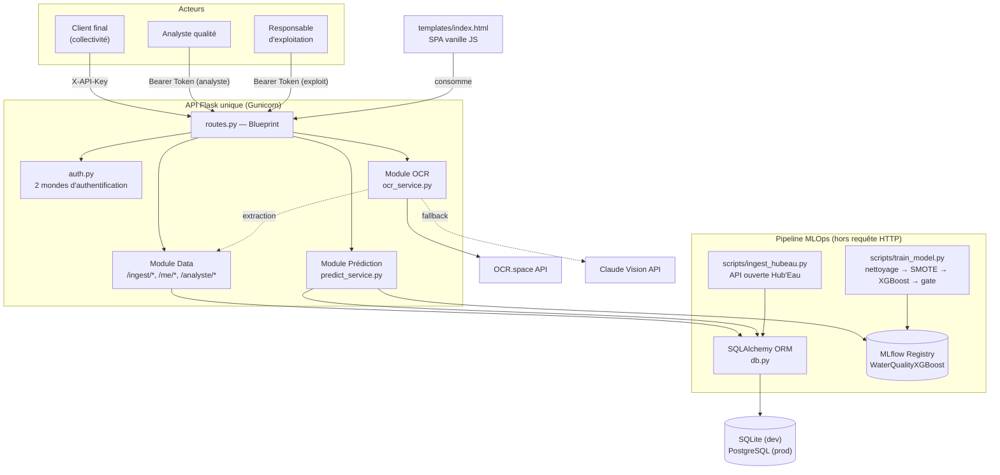
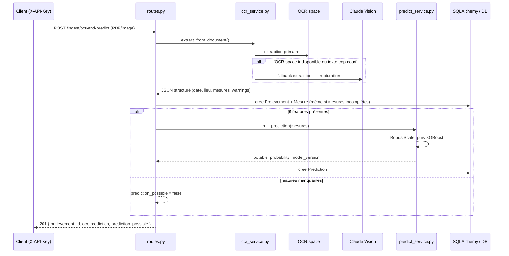
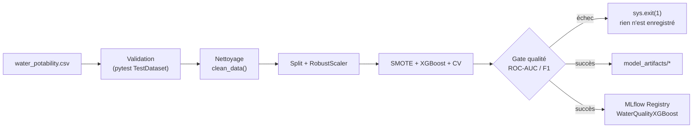

# Architecture technique — VigiEau

> Vue d'ensemble technique du dépôt. Pour le détail des données voir
> [[mcd]], pour la protection des données [[rgpd]], pour le pipeline
> modèle [[mlops_pipeline]], pour les parcours utilisateurs
> [[user_stories]] et [[wireframes]], pour un incident traité [[incident]].

## Vue d'ensemble

VigiEau est une plateforme centralisée exposée via **une seule API
Flask** qui porte trois responsabilités (Data, Prédiction, OCR), adossée à
une base relationnelle conforme RGPD et à un pipeline MLOps qui entraîne,
valide et enregistre le modèle XGBoost séparément de l'application.

## Structure du dépôt — un point d'attention

Le code applicatif existe en **deux emplacements** pour une partie des
modules : la source canonique est à la **racine**, et `api/` ne contient
que de fins **re-exports** (héritage du nettoyage documenté dans
`git log`, commit "nettoyage P4"). Exception : `api/app.py` est lui-même
canonique, et `app.py` racine est son re-export. À connaître avant de
modifier quoi que ce soit — éditer le mauvais fichier ne casse rien
techniquement (l'un réexporte l'autre) mais sème la confusion.

| Domaine | Source canonique | Re-export |
|---|---|---|
| Factory Flask | `api/app.py` | `app.py` (racine) |
| Routes | `routes.py` (racine) | `api/routes/routes.py` |
| Modèles SQLAlchemy | `db.py` (racine) | `api/models/db.py` |
| Authentification | `auth.py` (racine) | `api/middleware/auth.py` |
| Service OCR | `ocr_service.py` (racine) | `api/services/ocr_service.py` |
| Service prédiction | `predict_service.py` (racine) | `api/services/predict_service.py` |
| Point d'entrée process | `main.py` — `gunicorn main:app` | — |

Les scripts autonomes (`scripts/*.py`) importent toujours les modules
**racine** directement (`from db import ...`, `from routes import ...`),
jamais `api.*`.

## Composants applicatifs

| Fichier | Rôle |
|---|---|
| `main.py` | Point d'entrée Gunicorn (`main:app`) |
| `api/app.py` | Factory Flask — enregistre le blueprint, initialise la DB, monte Swagger (`/apidocs`) |
| `auth.py` | Double authentification : clé API client (SHA-256, comparaison temps constant) + Bearer token expert (`EXPERT_TOKENS`) ; journalisation RGPD (`log_audit`) et métriques (`record_metric`) |
| `db.py` | Modèles SQLAlchemy (`Client`, `Prelevement`, `Mesure`, `Prediction`, `AuditLog`, `RequestMetric`) + `init_db()` — détail entités/cardinalités dans [[mcd]] |
| `routes.py` | Toutes les routes HTTP, groupées par périmètre (voir ci-dessous) |
| `ocr_service.py` | OCR.space (primaire) + Claude Vision (fallback) — benchmark des solutions dans ce même fichier (docstring) |
| `predict_service.py` | Chargement paresseux du modèle (MLflow puis repli fichier local) + pipeline de prédiction (`RobustScaler` → `XGBoost`) |
| `templates/index.html` | Interface web unique (SPA vanille JS + Tailwind), consomme l'API — parcours détaillés dans [[wireframes]] |

### Routes par périmètre (`routes.py`)

| Périmètre | Authentification | Exemples de routes |
|---|---|---|
| Client | `X-API-Key` (`@require_client_key`) | `POST /ingest/manual`, `POST /ingest/ocr(-and-predict)`, `GET /me/prelevements`, `GET/DELETE /me/rgpd` |
| Admin | Bearer, tout expert | `POST/GET/PUT /admin/clients`, `POST /admin/clients/<id>/apikey` |
| Analyste | Bearer, rôle `analyste` (ou `exploit`, super-rôle) | `GET /analyste/dashboard`, `GET /analyste/prelevements` (filtrable `client_id`/`source`/`potable`/dates) |
| Exploitation | Bearer, rôle `exploit` uniquement | `GET /exploitation/metrics`, `GET /exploitation/audit` |
| Public | — | `GET /health` |

## Flux d'un prélèvement OCR

## Pipeline MLOps (hors requête HTTP)

Deux scripts autonomes, découplés de l'API, orchestrés par
`.github/workflows/` :

- **`scripts/ingest_hubeau.py`** — importe des prélèvements depuis l'API
  ouverte Hub'Eau (contrôle sanitaire de l'eau potable), les mappe vers le
  même schéma `Prelevement`/`Mesure`, source `IngestionSource.OPENDATA`.
- **`scripts/train_model.py`** — reproduit le pipeline de nettoyage/entraînement
  (`water_xgboost.ipynb` porté en script) : validation des données →
  nettoyage → `RobustScaler` → `SMOTE` → `XGBoost` → cross-validation →
  **gate qualité** (ROC-AUC/F1 minimums) → sauvegarde `model_artifacts/` →
  enregistrement MLflow. Détail complet, limites connues et schéma de la
  chaîne : [[mlops_pipeline]].

## CI/CD

Deux workflows GitHub Actions séparés, déclencheurs différents :

| Workflow | Déclencheur | Étapes |
|---|---|---|
| `.github/workflows/ci.yml` | push/PR sur `main`/`develop` | lint (ruff) → `pytest tests/` → build image Docker (GHCR) → déploiement SSH (`main` uniquement, secrets requis) |
| `.github/workflows/model-ci.yml` | `workflow_dispatch` ou push touchant `water_potability.csv`/`scripts/train_model.py`/`requirements.txt` | validation données → entraînement/évaluation/gate → publication des artefacts modèle |

## Déploiement (Docker)

`Dockerfile` : image `python:3.11-slim`, utilisateur non-root, `gunicorn`
(2 workers) sur le port 8080, healthcheck sur `/health`.

`docker-compose.yml` : un seul service, volume persistant `vigieau_data`
pour les bases SQLite (`DATABASE_URL=sqlite:////data/vigieau.db`,
`MLFLOW_TRACKING_URI=sqlite:////data/mlflow_water.db`), `model_artifacts/`
monté en lecture seule. **Limite connue** : pas de service PostgreSQL dans
le compose bien que `DATABASE_URL` l'accepte — SQLite en prod à ce stade
(voir `RAPPORT_CONFORMITE.md`).

## Authentification et RGPD

Deux mondes d'authentification strictement séparés dans `auth.py`
(`require_client_key` / `require_expert(role=...)`), tous deux
journalisés dans `audit_logs` via `log_audit()` et chronométrés dans
`request_metrics` via le décorateur `@timed`. Détail des mesures de
protection, durées de conservation et droits RGPD : [[rgpd]].

## Choix techniques

- **Flask** plutôt que FastAPI : cohérence avec le projet Waterflow 1
  d'origine, écosystème déjà maîtrisé.
- **SQLite en dev / PostgreSQL visé en prod** : bascule transparente via
  `DATABASE_URL`, non finalisée (voir limite ci-dessus).
- **OCR.space** comme service primaire après veille comparative (Azure
  Form Recognizer, Google Vision, Tesseract) : meilleur rapport
  qualité/prix pour du PDF en français, avec repli Claude Vision.
- **MLflow** pour la traçabilité du modèle : version enregistrée dans
  chaque prédiction stockée ; enregistrement conditionné à un seuil de
  qualité automatisé depuis cette session (voir [[mlops_pipeline]]).
- **SHA-256 + comparaison temps constant** pour les clés API et tokens
  experts plutôt qu'un stockage en clair.
- **Hub'Eau plutôt que du scraping HTML** pour la source de données
  ouverte complémentaire (C1) : API publique stable, pas de fragilité
  face aux changements de mise en page, pas de zone grise juridique.

## Autres notes du vault

- [[mcd]] — modélisation des données (MCD/MPD, formalisme Merise)
- [[rgpd]] — note RGPD complète
- [[user_stories]] — user stories et critères d'acceptation (dont RGAA)
- [[wireframes]] — parcours experts (analyste, exploit, admin)
- [[mlops_pipeline]] — chaîne CI/CD du modèle en détail
- [[incident]] — fiche incident traitée
- [[roadmap]] — suivi des correctifs
- [[plan_certification_rncp]] — plan de travail vs. matrice de conformité RNCP 37827
