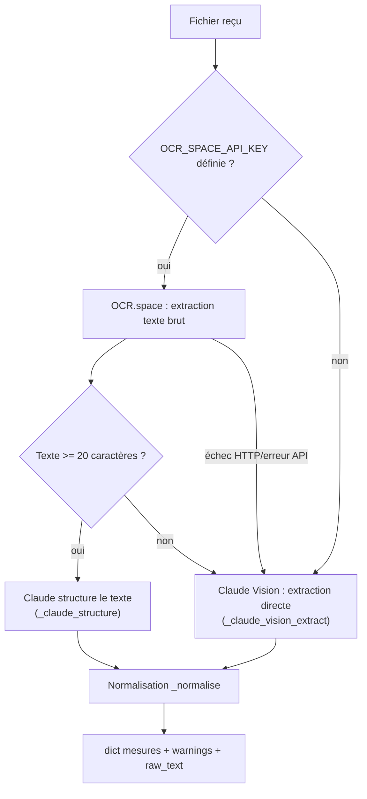

> Brouillon technique généré à partir du code du dépôt (`ocr_service.py`,
> `routes.py`, `tests/`) — factuel et vérifiable, sans reformulation
> narrative. Voir [[architecture]] pour le diagramme de séquence complet
> du pipeline OCR → prédiction.

# Documentation technique — Service OCR (E2)

## 1. Objectif du composant

Extraire automatiquement les 9 mesures physico-chimiques (`ph`,
`Hardness`, `Solids`, `Chloramines`, `Sulfate`, `Conductivity`,
`Organic_carbon`, `Trihalomethanes`, `Turbidity`) et les métadonnées
(date, lieu, observations) d'une fiche de laboratoire déposée en image ou
PDF, pour alimenter le pipeline de prédiction sans ressaisie manuelle.

## 2. Veille comparative et choix (C7)

Comparatif formalisé dans `ocr_service.py:4-17` (docstring du module) :

| Solution | Gratuit/mois | PDF natif | Remarques |
|---|---|---|---|
| **OCR.space** (retenu) | 25 000 req | Oui | Simple, REST, résultats exploitables en français |
| Google Vision | 1 000 unités | Via conversion | Très précis, coûteux à volume |
| Azure Form Recognizer | 500 pages | Oui, natif | Meilleur sur formulaires structurés |
| Tesseract (OSS) | Illimité | Non direct | Auto-hébergé, latence supplémentaire |
| Claude Vision | Selon usage | Via images | Compréhension sémantique supérieure |

**Décision** : OCR.space comme service primaire (plan gratuit suffisant
pour un MVP, API REST simple, support PDF natif), **Claude Vision comme
repli** — pas un second choix théorique mais un vrai composant actif du
pipeline (voir §3).

## 3. Architecture et paramétrage (C8)

Point d'entrée unique : `extract_from_document(file_bytes, mime)`
(`ocr_service.py:194-230`).

- **OCR.space** (`_ocr_space`, `ocr_service.py:71-95`) : POST multipart en
  base64 vers `https://api.ocr.space/parse/image`, `language=fre`,
  `OCREngine=2` (meilleur sur tableaux structurés), `timeout=30`.
- **Claude structure** (`_claude_structure`, `ocr_service.py:141-161`) :
  le texte brut OCR.space est repassé à Claude (`claude-opus-4-6`) avec un
  prompt d'extraction structurée (`_EXTRACTION_PROMPT`) pour produire le
  JSON final.
- **Claude Vision** (`_claude_vision_extract`, `ocr_service.py:100-136`) :
  utilisé quand `OCR_SPACE_API_KEY` est absente, ou si OCR.space échoue
  ou renvoie moins de 20 caractères (`ocr_service.py:211-212`) — bascule
  automatique, journalisée en `warning` (`ocr_service.py:219`), pas
  d'interruption de la requête cliente.
- **Formats acceptés** (`ACCEPTED_MIME`, `ocr_service.py:42-45`) :
  `image/jpeg`, `image/jpg`, `image/png`, `image/webp`, `image/gif`,
  `application/pdf`.
- **Configuration** : variables d'environnement `OCR_SPACE_API_KEY` et/ou
  `ANTHROPIC_API_KEY` (au moins une requise — voir `README.md`,
  section Variables d'environnement). Aucune clé en dur dans le code.

## 4. Normalisation des données

`_normalise()` (`ocr_service.py:166-189`) — appelée après les deux
stratégies d'extraction, garantit un contrat de sortie stable :

- conversion virgule décimale → point (`"7,2"` → `7.2`) ;
- toute feature des 9 attendues absente ou non numérique → `None` +
  entrée dans `warnings` (pas d'exception, pas de valeur devinée) ;
  cohérent avec la consigne du prompt d'extraction : *"Si valeur floue →
  null + warning. Ne devine pas."* (`ocr_service.py:66`) ;
  ` `date_prelevement`, `id_client`, `lieu`, `observations`, `raw_text`
  toujours présents dans le dict retourné (valeurs par défaut `None`/`""`).

## 5. Intégration API et gestion d'erreur

Deux routes consomment `extract_from_document()` (`routes.py`) :

| Route | Comportement |
|---|---|
| `POST /ingest/ocr` | Stocke le prélèvement même si des mesures manquent — **aucune prédiction automatique** |
| `POST /ingest/ocr-and-predict` | Enchaîne extraction → stockage → prédiction si les 9 mesures sont présentes (`prediction_possible: true/false` sinon) |

Codes retour (`routes.py:484-495`) :

| Cas | Code | Origine |
|---|---|---|
| Champ `file` absent, type MIME non supporté, fichier > 20 Mo | 400 | `_read_upload()` (`routes.py:65-78`) |
| Aucun service OCR disponible (`RuntimeError`) | 503 | `extract_from_document()` |
| Erreur inattendue pendant l'extraction | 500 | `except Exception`, journalisé via `logger.exception` |

## 6. Tests

12 tests touchent directement ce composant : 2 dans `tests/test_api.py`
(`test_ingest_ocr_sans_fichier`, `test_ingest_ocr_type_invalide` — cas
d'erreur 400) et 10 dans `tests/test_e2e.py` (pipeline complet OCR →
prélèvement → prédiction, OCR et modèle mockés — voir `tests/test_e2e.py:65-66`
pour le point de mock `mlflow.xgboost.load_model`/`joblib.load`). Aucun
appel réseau réel dans la suite `pytest` : OCR.space et Claude Vision ne
sont jamais sollicités en CI.

## 7. Exemples fournis

`samples/` (voir `samples/README.md`) : `fiche_labo_anonymisee.txt` (fiche
complète, texte brut anonymisé) et `exemple_extraction_ocr.json` (résultat
attendu), avec une commande `curl` de démonstration contre
`/ingest/ocr-and-predict`.

## 8. Limites connues

- Pas de retry/backoff sur l'appel OCR.space — un seul essai, puis bascule
  directe sur Claude Vision (stratégie de repli, pas de nouvelle tentative
  du même service).
- Le seuil de bascule (20 caractères de texte brut, `ocr_service.py:211`)
  est une heuristique, pas une mesure de confiance de l'OCR.
- Dépendance à deux services tiers payants au-delà des quotas gratuits —
  aucun fallback local (Tesseract) implémenté malgré sa présence dans le
  comparatif.
