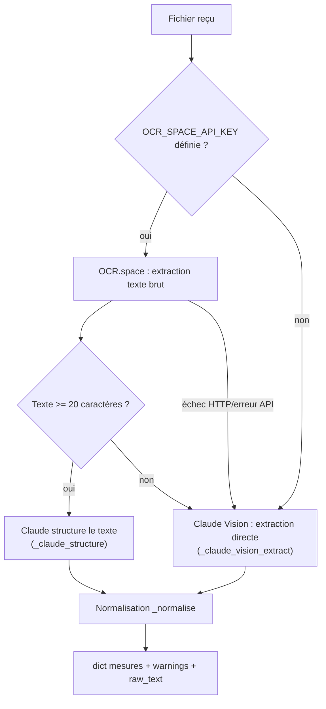
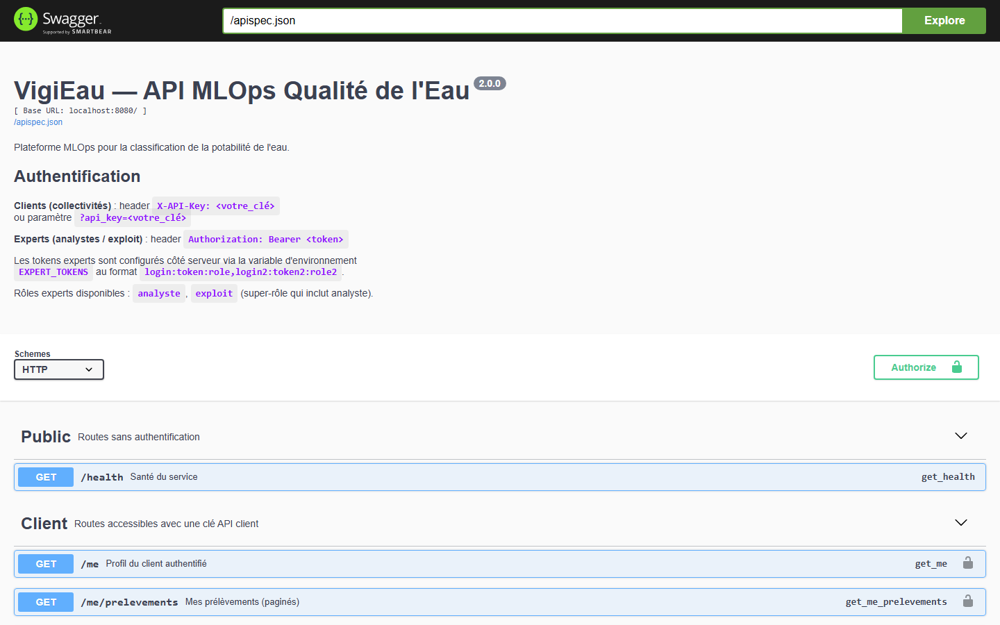

> Structure organisée par compétence (C6, C7, C8), conforme à la consigne
> du REAC. Voir [[architecture]] pour le diagramme de séquence complet du
> pipeline OCR → prédiction.

# Documentation technique — Service OCR (E2)

**Dépôt du projet (public)** : https://github.com/ali-bousrira/VigiEau

## Objectif du composant

Extraire automatiquement les 9 mesures physico-chimiques (`ph`,
`Hardness`, `Solids`, `Chloramines`, `Sulfate`, `Conductivity`,
`Organic_carbon`, `Trihalomethanes`, `Turbidity`) et les métadonnées
(date, lieu, observations) d'une fiche de laboratoire déposée en image ou
PDF, pour alimenter le pipeline de prédiction sans ressaisie manuelle.

**Besoin client** (fictif, ancré sur le projet) : les collectivités
clientes reçoivent leurs analyses d'un laboratoire externe sous forme de
fiche PDF ou scannée, et les ressaisissaient manuellement avant de pouvoir
les exploiter — source d'erreurs de saisie et de délai. Le besoin est
d'automatiser cette extraction sans dépendre d'un unique fournisseur.

---

## C6 — Réaliser une veille technique et réglementaire

**Sur quoi porte cette veille** : le besoin client est celui énoncé plus
haut — automatiser l'extraction de fiches de laboratoire (PDF/scan) pour
ne plus dépendre d'une ressaisie manuelle, sans dépendre d'un unique
fournisseur en cas de panne ou de changement tarifaire. La veille porte
donc sur les **services d'extraction de texte/OCR** disponibles pour
répondre à ce besoin précis, pas sur l'IA en général.

Comparatif formalisé dans `ocr_service.py:4-17` (docstring du module) :

| Solution | Gratuit/mois | PDF natif | Remarques |
|---|---|---|---|
| **OCR.space** (retenu) | 25 000 req | Oui | Simple, REST, résultats exploitables en français |
| Google Vision | 1 000 unités | Via conversion | Très précis, coûteux à volume |
| Azure Form Recognizer | 500 pages | Oui, natif | Meilleur sur formulaires structurés |
| Tesseract (OSS) | Illimité | Non direct | Auto-hébergé, latence supplémentaire |
| Claude Vision | Selon usage | Via images | Compréhension sémantique supérieure |

Sources de veille : documentation officielle de chaque fournisseur,
comparatifs publics de services OCR, et test manuel direct (envoi de
fiches d'exemple à chaque service candidat) plutôt qu'une évaluation
purement théorique.

**Veille ponctuelle, pas automatisée** : cette comparaison a été menée à
un instant donné, pas via un flux surveillé en continu (RSS, agrégateurs
type Hacker News, InoReader...). Pour un service en évolution rapide
(nouveaux modèles, tarifs qui changent), une veille automatisée serait
plus robuste — je le note comme limite assumée plutôt que de prétendre
avoir mis en place un dispositif que je n'ai pas construit : le temps
disponible est allé en priorité vers la correction de bugs réels et de
lacunes de sécurité ailleurs dans le projet, pas vers l'outillage de
veille pour un comparatif qui n'a de toute façon vocation à être refait
qu'occasionnellement.

**Accessibilité, appliquée concrètement à ce document** : RGAA/WCAG
critère "ne pas transmettre une information par la couleur seule" — le
statut de chaque solution (retenue ou non) est porté par le texte
("retenu" en gras), pas par une pastille colorée ; hiérarchie de titres
cohérente (H1 unique, puis H2 par compétence) plutôt que du texte gras
utilisé comme faux titre.

**Critères de sélection retenus, point par point** — pour rendre la
décision auditable plutôt qu'affirmée :

| Critère | Poids dans la décision | OCR.space | Claude Vision (repli) |
|---|---|---|---|
| Coût à l'usage MVP | Élevé | Gratuit jusqu'à 25 000 req/mois | Facturé à l'usage, réservé au repli |
| Support PDF natif | Élevé | Oui | Oui (image) |
| Simplicité d'intégration | Moyen | REST simple, une clé | SDK Anthropic déjà utilisé ailleurs (OCR structuration) |
| Dépendance à un seul fournisseur | Élevé (contrainte du besoin) | Écartée par le repli croisé (C8) | — |
| Précision sur fiches manuscrites/dégradées | Moyen | Correcte | Supérieure (compréhension sémantique) |

---

## C7 — Identifier des services d'IA préexistants

**Décision** : OCR.space comme service primaire (plan gratuit suffisant
pour un MVP, API REST simple, support PDF natif), **Claude Vision comme
repli** — pas un second choix théorique mais un vrai composant actif du
pipeline (voir C8).

**Éco-responsabilité** : le choix d'un service OCR spécialisé et léger
(OCR.space) comme option *primaire*, plutôt que de router systématiquement
chaque extraction vers un modèle multimodal généraliste, limite le
recours au modèle le plus coûteux en calcul (Claude Vision) aux seuls cas
où le premier échoue ou est indisponible (voir C8) — un choix
d'architecture qui va dans le sens de la sobriété plutôt que l'inverse.
Je n'ai pas de rapport d'impact carbone officiel pour OCR.space à citer ;
je documente honnêtement cette limite plutôt que d'affirmer une donnée
que je n'ai pas vérifiée.

---

## C8 — Paramétrer un service d'IA

Point d'entrée unique : `extract_from_document(file_bytes, mime)`
(`ocr_service.py:194-230`).



- **OCR.space** (`_ocr_space`, `ocr_service.py:71-95`) : POST multipart en
  base64 vers `https://api.ocr.space/parse/image`, `language=fre`,
  `OCREngine=2` (meilleur sur tableaux structurés), `timeout=30`.
- **Claude structure** (`_claude_structure`, `ocr_service.py:141-161`) :
  le texte brut OCR.space est repassé à Claude (`claude-opus-4-6`) avec un
  prompt d'extraction structurée (`_EXTRACTION_PROMPT`) pour produire le
  JSON final.
- **Claude Vision** (`_claude_vision_extract`, `ocr_service.py:100-136`) :
  utilisé quand `OCR_SPACE_API_KEY` est absente, ou si OCR.space échoue
  ou renvoie moins de 20 caractères (`ocr_service.py:211-212`) — bascule
  automatique, journalisée en `warning` (`ocr_service.py:219`), pas
  d'interruption de la requête cliente.
- **Formats acceptés** (`ACCEPTED_MIME`, `ocr_service.py:42-45`) :
  `image/jpeg`, `image/jpg`, `image/png`, `image/webp`, `image/gif`,
  `application/pdf`.
- **Configuration** : variables d'environnement `OCR_SPACE_API_KEY` et/ou
  `ANTHROPIC_API_KEY` (au moins une requise — voir `README.md`,
  section Variables d'environnement). Aucune clé en dur dans le code.
- **Monitorage** : le service n'a pas de dashboard dédié, mais chaque
  extraction est journalisée (`audit_logs`, actions `client_ingest_ocr*`)
  et comptabilisée dans les métriques applicatives génériques
  (`request_metrics`, voir [[doc_technique_e5]] §C20) — pas un monitorage
  de modèle IA au sens MLflow (ça, c'est C11, voir [[rapport_e3]]).

**Accessibilité de la documentation d'installation** — le REAC demande
explicitement, au moment de documenter l'installation d'un service,
d'en profiter pour mentionner l'accessibilité. Constat réel sur
`README.md` : le tableau des variables d'environnement
(`README.md:172-187`) est une vraie table Markdown à en-têtes
(`Variable | Obligatoire | Défaut | Description`), navigable par lecteur
d'écran via ses en-têtes de colonnes ; les étapes d'installation
(`README.md:56-101`), elles, ne sont que des commentaires `# 1. ...` à
l'intérieur d'un unique bloc de code bash — sans structure sémantique de
liste ordonnée, un lecteur d'écran les annoncera comme du contenu de
bloc de code, pas comme des étapes numérotées. Limite honnête plutôt que
corrigée ici (le README n'est pas un livrable de ce rapport).

**Documentation OpenAPI du service**, accessible sur `/apidocs` — les
deux routes de dépôt (`/ingest/ocr`, `/ingest/ocr-and-predict`)
apparaissent avec leurs schémas de requête/réponse, au même titre que
les autres routes de l'API unique (cohérent avec l'architecture C15,
voir [[rapport_e4]]) :



### Normalisation des données

`_normalise()` (`ocr_service.py:165-188`) — appelée après les deux
stratégies d'extraction, garantit un contrat de sortie stable quelle que
soit la stratégie qui a produit les données :

```python
def _normalise(data: dict) -> dict[str, Any]:
    mesures  = data.get("mesures", {})
    warnings = list(data.get("warnings", []))

    for field in FEATURES:
        val = mesures.get(field)
        if val is None:
            warnings.append(f"Champ absent ou illisible : {field}")
        else:
            try:
                mesures[field] = float(str(val).replace(",", "."))
            except (ValueError, TypeError):
                warnings.append(f"Valeur non numérique pour {field} : {val!r}")
                mesures[field] = None

    data["mesures"], data["warnings"] = mesures, warnings
    data.setdefault("date_prelevement", None)
    ...
    return data
```

- conversion virgule décimale → point (`"7,2"` → `7.2`) ;
- toute feature des 9 attendues absente ou non numérique → `None` +
  entrée dans `warnings` (pas d'exception, pas de valeur devinée) ;
  cohérent avec la consigne du prompt d'extraction : *"Si valeur floue →
  null + warning. Ne devine pas."* (`ocr_service.py:66`) ;
  `date_prelevement`, `id_client`, `lieu`, `observations`, `raw_text`
  toujours présents dans le dict retourné (valeurs par défaut `None`/`""`).

### Intégration API et gestion d'erreur

Deux routes consomment `extract_from_document()` (`routes.py`) :

| Route | Comportement |
|---|---|
| `POST /ingest/ocr` | Stocke le prélèvement même si des mesures manquent — **aucune prédiction automatique** |
| `POST /ingest/ocr-and-predict` | Enchaîne extraction → stockage → prédiction si les 9 mesures sont présentes (`prediction_possible: true/false` sinon) |

Le comportement `prediction_possible: false` sur mesures incomplètes
n'est pas qu'une affirmation de prose : `test_e2e_ocr_mesures_partielles_prediction_impossible`
(`tests/test_e2e.py:237-253`) mocke `extract_from_document` avec une
seule mesure sur 9 (`{"ph": 7.0}`), poste sur `/ingest/ocr-and-predict`,
et vérifie `prediction_possible is False` tout en confirmant que le
prélèvement est quand même sauvegardé (`prelevement_id` présent).

Codes retour (`routes.py:484-495`) :

| Cas | Code | Origine |
|---|---|---|
| Champ `file` absent, type MIME non supporté, fichier > 20 Mo | 400 | `_read_upload()` (`routes.py:65-78`) |
| Aucun service OCR disponible (`RuntimeError`) | 503 | `extract_from_document()` |
| Erreur inattendue pendant l'extraction | 500 | `except Exception`, journalisé via `logger.exception` |

### Tests

12 tests touchent directement ce composant : 2 dans `tests/test_api.py`
(`test_ingest_ocr_sans_fichier`, `test_ingest_ocr_type_invalide` — cas
d'erreur 400) et 10 dans `tests/test_e2e.py` (pipeline complet OCR →
prélèvement → prédiction, OCR et modèle mockés). Aucun appel réseau réel
dans la suite `pytest` : OCR.space et Claude Vision ne sont jamais
sollicités en CI.

### Exemples fournis

`samples/` (voir `samples/README.md`) : `fiche_labo_anonymisee.txt` (fiche
complète, texte brut anonymisé) et `exemple_extraction_ocr.json` (résultat
attendu), avec une commande `curl` de démonstration contre
`/ingest/ocr-and-predict`. Deux fichiers plus démonstratifs, déjà cités
dans `README.md` et `RAPPORT_CONFORMITE.md` mais absents de
`samples/README.md`, illustrent en plus la paire nominal/dégradé :
`fiche_labo_exemple_1.txt` (fiche complète → `prediction_possible=true`)
et `fiche_labo_exemple_2_partiel.txt` (pH/Turbidité/Conductivité
seulement → `prediction_possible=false`, cas couvert par le test cité
ci-dessus).

### Limites connues

- Pas de retry/backoff sur l'appel OCR.space — un seul essai, puis bascule
  directe sur Claude Vision (stratégie de repli, pas de nouvelle tentative
  du même service).
- Le seuil de bascule (20 caractères de texte brut, `ocr_service.py:211`)
  est une heuristique, pas une mesure de confiance de l'OCR.
- Dépendance à deux services tiers payants au-delà des quotas gratuits —
  aucun fallback local (Tesseract) implémenté malgré sa présence dans le
  comparatif.
- **Asymétrie de journalisation RGPD** : `log_audit()` n'est appelé que
  sur le chemin de succès des deux routes OCR (`routes.py:505` et `:560`,
  toutes deux en 201). Les branches d'erreur (400 fichier absent/type
  invalide, 503 aucun service OCR disponible, 500 exception inattendue —
  `routes.py:487-497`) ne journalisent rien dans `audit_logs`,
  contrairement à `/ingest/manual` qui, lui, journalise explicitement son
  cas d'erreur 400 (`routes.py:456-458`). Seul `request_metrics` capture
  ces échecs (via `@timed`), sans sémantique acteur/ressource RGPD.
