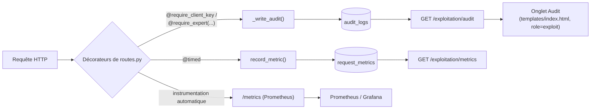
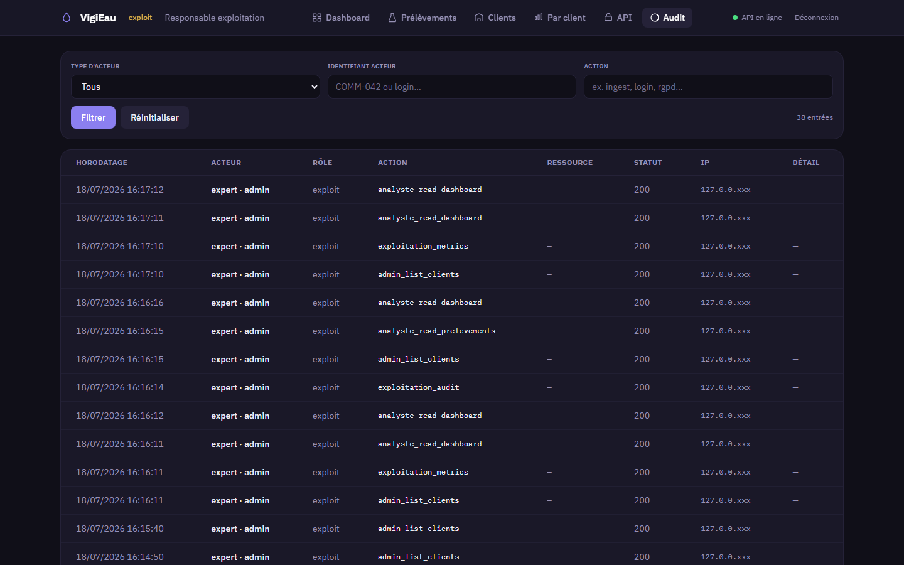
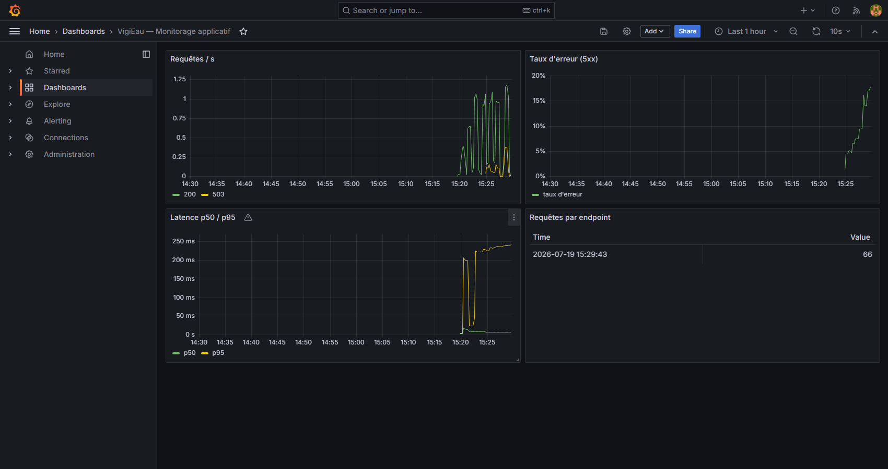
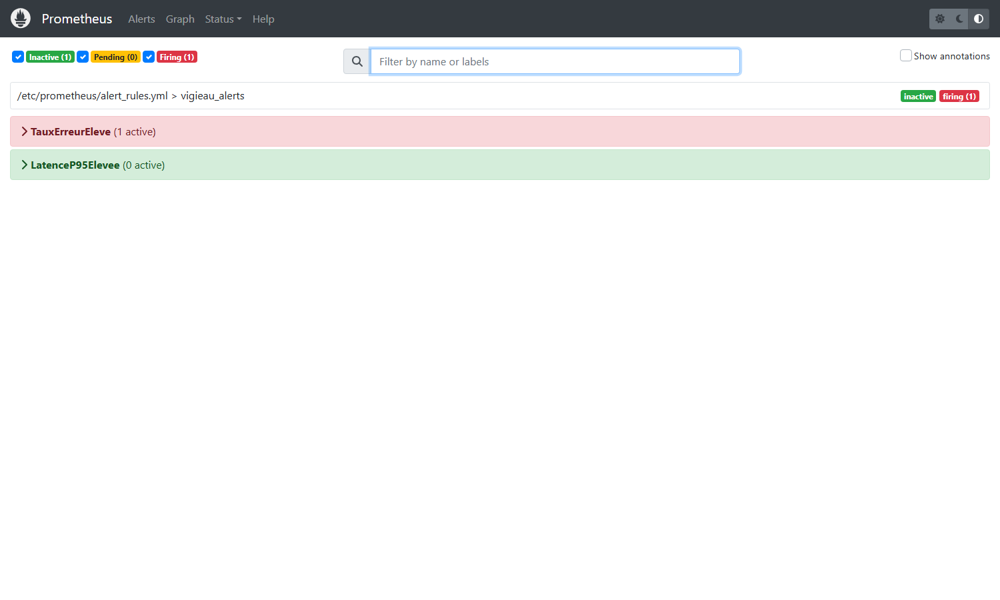
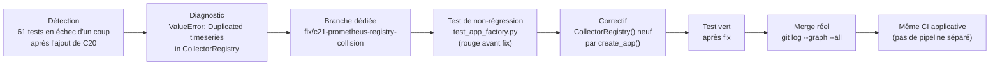

# Documentation technique — Monitorage et incident (E5)

**Dépôt du projet (public)** : https://github.com/ali-bousrira/VigiEau

## Objectif

Donner à l'équipe d'exploitation une visibilité sur la santé de la
plateforme (volume, latence, erreurs) et une traçabilité complète des
accès aux données (exigence RGPD, détaillée dans [[rgpd]]), et démontrer
la capacité à détecter, diagnostiquer et corriger un incident réel via ce
même monitorage. Voir [[architecture]] pour la vue d'ensemble technique.

---

## C20 — Monitorer une application d'IA

Trois mécanismes complémentaires, tous déclenchés depuis chaque requête :

### Métriques de performance maison (`request_metrics`)

- **Écriture** : décorateur `@timed` (`auth.py:370-388`), placé après les
  décorateurs d'authentification sur chaque route. Mesure la durée réelle
  (`time.perf_counter()`) et appelle `record_metric()` (`auth.py:238-264`)
  quel que soit le code retour.
- **Modèle** (`db.py:245-257`, table `request_metrics`) : `route`,
  `method`, `status_code`, `duration_ms`, `actor_type`, `actor_hint`
  (hint de clé API ou login expert — jamais la clé/le token en clair).
- **Exposition** : `GET /exploitation/metrics` (`routes.py:985-1037`, rôle
  `exploit` uniquement) — agrège les `limit` dernières requêtes par
  route : nombre, taux d'erreur, p50/p95/moyenne de latence.

### Journal applicatif (`logging`)

Exigence plancher explicite du REAC pour C20 ("minimum : `import
logging`"), présente dans le code mais jusqu'ici jamais nommée dans ce
rapport — les deux mécanismes maison ci-dessous s'ajoutent au module
standard Python, pas l'inverse :

- **Configuration centralisée** : `logging.basicConfig(level=logging.INFO,
  format="%(asctime)s [%(levelname)s] %(name)s — %(message)s")`
  (`api/app.py:40-43`), appliquée une fois au démarrage de l'application.
- **Validation de config au démarrage** (`auth.py:59-129`,
  `_load_expert_tokens`) : `logger.warning` si `EXPERT_TOKENS` est
  absente, une entrée est malformée, un rôle est inconnu, un token est
  trop court ou en collision de hash ; `logger.info` par expert chargé
  avec succès — détecter une auth mal configurée avant qu'elle ne bloque
  silencieusement un expert, pas juste "logger pour logger".
- **Erreurs d'extraction** : `logger.exception("Erreur OCR")`
  (`routes.py:496` et `:533`) sur les deux routes d'ingestion OCR.
- **Repli de service** : `logger.warning`/`logger.info` dans
  `predict_service.py:43-74` (bascule MLflow → fichier local, voir
  [[rapport_e3]] C11) et `ocr_service.py:205-227` (bascule OCR.space →
  Claude Vision, avec taille de fichier et nombre de caractères extraits
  en clair dans le log).

### Journal d'accès RGPD (`audit_logs`)

- **Écriture** : `log_audit()`/`_write_audit()` (`auth.py:187-235`),
  appelée explicitement dans chaque route sensible. Non bloquant : une
  erreur d'écriture d'audit est journalisée et absorbée, elle ne fait
  jamais échouer la requête métier.
- **Modèle** (`db.py:222-243`) : `timestamp`, `actor_type`, `actor_id`,
  `actor_role`, `ip_address` (pseudonymisée — voir [[rgpd]]), `action`,
  `resource_id`, `status_code`, `detail`. Immuable par convention
  applicative : aucune route DELETE/UPDATE n'existe sur cette table.
- **Exposition** : `GET /exploitation/audit` (rôle `exploit` strict — un
  `analyste` reçoit 403), paginée, filtrable. Interface dédiée
  (onglet "Audit", visible uniquement pour le rôle `exploit`) vérifiée en
  conditions réelles (navigateur headless) : les entrées réelles
  s'affichent avec IP pseudonymisée (ex. `127.0.0.xxx`).

**Onglet Audit, capturé en conditions réelles** (serveur local, données
de test) — filtres acteur/action, et IP effectivement pseudonymisée sur
chaque ligne, pas seulement dans le code :

### Stack Prometheus/Grafana (ajoutée cette session)

Ajoutée pour couvrir explicitement le collecteur/agrégateur/dashboard/
alertes à seuils attendus par C20, en complément (pas en remplacement) du
monitorage maison ci-dessus, qui reste utile pour la traçabilité RGPD par
requête que Prometheus ne couvre pas.

- **Exposition** : `GET /metrics` (`api/app.py`, via
  `prometheus_flask_exporter.PrometheusMetrics(app, group_by="endpoint")`)
  — format texte Prometheus natif, instrumente automatiquement toutes les
  routes existantes sans toucher `routes.py`. Vérifié en réel : après
  quelques requêtes contre un serveur local, `flask_http_request_total`
  et `flask_http_request_duration_seconds_bucket` remontent bien avec les
  labels `method`/`status`/`endpoint` attendus.
- **Collecteur** : `prometheus.yml` — scrape `vigieau:8080/metrics`
  toutes les 15s, charge les règles d'alerte via `rule_files`.
- **Alertes** (`monitoring/alert_rules.yml`, seuils explicites) :
  `TauxErreurEleve` (> 5 % de réponses 5xx sur 5 min) et
  `LatenceP95Elevee` (p95 > 2s sur 5 min), toutes deux avec `for: 2m`
  pour éviter les faux positifs sur un pic isolé. Évaluées nativement par
  Prometheus (visibles sur son UI `/alerts`), pas besoin d'Alertmanager
  pour que les seuils soient "configurés et fonctionnels".
- **Dashboard** : `monitoring/grafana/dashboards/dashboard.json`,
  provisionné automatiquement au démarrage de Grafana — requêtes/s par
  code retour, taux d'erreur, latence p50/p95, requêtes par endpoint.
- **Déploiement** : deux services ajoutés à `docker-compose.yml`
  (`prometheus`, `grafana`), images officielles, ports 9090/3000.

**Vérifiée de bout en bout via `docker compose up`**, pas seulement en
config statique — et cette vérification a immédiatement révélé un vrai
bug jamais rencontré avant faute d'avoir testé la stack complète :
l'image Docker bascule sur un utilisateur non-root (`vigieau`), mais
`/data` (point de montage du volume nommé `vigieau_data`, où vit la base
SQLite en conteneur) n'était jamais chowné pour cet utilisateur —
`sqlite3.OperationalError: unable to open database file` au démarrage,
boucle de redémarrage. Corrigé dans `Dockerfile` (`mkdir -p /data &&
chown -R vigieau /app /data`, avant le `USER vigieau`) ; au passage,
`docker-compose.yml` ne transmettait pas non plus `EXPERT_TOKENS` au
conteneur `vigieau` (aucun expert n'aurait pu se connecter) — corrigé de
la même façon.

Une fois ces deux corrections faites, stack vérifiée réellement en
marche :

- Prometheus scrape bien `vigieau:8080/metrics`
  (`GET /api/v1/targets` → `"health":"up"`).
- Dashboard Grafana provisionné automatiquement, affiche des données
  réelles générées par du trafic authentifié réel (login `exploit`,
  plusieurs routes) :

- **Alerte `TauxErreurEleve` déclenchée pour de vrai**, pas seulement
  configurée : trafic réel envoyé vers `/ingest/ocr` sans clé OCR
  configurée (503 systématique, cas déjà documenté plus haut) pendant
  plus de 2 minutes (`for: 2m`) — l'alerte passe `inactive` → `pending` →
  **`firing`**, avec la valeur réelle interpolée par Prometheus
  (`{{ $value | humanizePercentage }}` → **14.04 %**, bien au-dessus du
  seuil de 5 %) :

`LatenceP95Elevee` est restée `inactive` durant ce test (aucune requête
lente générée) — preuve que les deux règles évaluent chacune leur propre
condition indépendamment, pas un déclenchement groupé artificiel.

**Distinction avec C11** : ceci est du monitorage *applicatif* (volume,
latence, erreurs HTTP) — le monitorage du *modèle* (MLflow) est une
compétence distincte, voir [[rapport_e3]] C11. Le REAC signale lui-même
ce risque de confusion.

---

## C21 — Résoudre un incident technique et documenter la solution

`docs/incident.md` documente deux scénarios :

1. **Un scénario simulé** (OCR.space indisponible), conformément à la
   consigne du cahier des charges — utile comme exercice de méthodologie
   (détection → diagnostic → correction → leçons tirées), mais un
   incident *imaginé*, pas rencontré.
2. **Un scénario réel**, rencontré cette session en développant le
   monitorage Prometheus (C20) : `prometheus_flask_exporter` enregistre
   ses métriques dans le registre global `prometheus_client.REGISTRY` par
   défaut ; `create_app()` étant appelée plusieurs fois dans le même
   processus (une fois par fichier de test), le deuxième appel levait
   `ValueError: Duplicated timeseries in CollectorRegistry` — 61 tests en
   échec d'un coup. Corrigé en passant un `CollectorRegistry()` neuf à
   chaque appel de `create_app()` plutôt que de dépendre du registre
   global implicite.

**Preuve traçable dans l'historique Git**, pas seulement affirmée :
branche dédiée `fix/c21-prometheus-registry-collision`, créée depuis
`feature/c20-monitoring-prometheus-grafana` (donc après le commit qui
introduisait le bug) ; test de non-régression
(`tests/test_app_factory.py`) écrit et vérifié rouge avant le fix, vert
après ; fusionnée avec un vrai commit de merge, visible via
`git log --graph --all`. Déployée via la même CI applicative que le
reste du projet, pas de pipeline séparé pour ce fix. Détail complet
(logs, diagnostic pas à pas) : `docs/incident.md`.

`docs/incident.md:191` fige le chiffre au moment du fix (`226 passed,
contre 61 erreurs avant le fix`) — 8 tests ont été ajoutés depuis
(notamment les routes DELETE de C5). Rejoué pour ce rapport :
`pytest tests/ -q` → **234 passed**, le fix reste vert aujourd'hui, avec
un chiffre distinct de celui figé dans `incident.md` au moment du fix.

**Cycle suivi pour ce fix**, identique à la méthodologie du scénario
simulé (détection → diagnostic → correction → leçons tirées), mais
appliqué ici à un incident réellement rencontré :

Même structure que le scénario simulé de `docs/incident.md`, mais chaque
étape ici est vérifiable dans l'historique Git plutôt que décrite en
prose — la différence entre un exercice de méthodologie et un incident
réellement résolu.

**Point de vigilance sur le scénario simulé, revérifié** —
`docs/incident.md` a été relu contre le code actuel pour ce rapport : les
noms de fonction (`extract_from_document`), l'action d'audit
(`client_ingest_ocr_predict`) et le nombre de tests cités (10 dans
`test_e2e.py`) sont exacts. Seule une citation de ligne avait dérivé
(`routes.py:504-507,559-565` → en réalité `506-509,561-567`, `routes.py`
ayant grandi) — corrigée directement dans `docs/incident.md`.

---

## Tests

Aucun test dédié au monitorage maison lui-même (`record_metric`/
`log_audit` sont exercés indirectement par tous les tests d'intégration).
`tests/test_api.py` et `tests/test_non_regression.py` couvrent
`/exploitation/metrics` et `/exploitation/audit` (contrôle d'accès,
structure de réponse). `tests/test_accessibility.py` couvre l'onglet
Audit. `tests/test_app_factory.py` couvre spécifiquement la régression
C21 ci-dessus.

## Limites connues

- Alertes Prometheus définies et évaluées nativement, mais sans canal de
  notification configuré (email/Slack) — un seuil dépassé apparaît sur
  l'UI Prometheus, mais personne n'est notifié activement pour l'instant.
- Ni `audit_logs` ni `request_metrics` n'ont de purge automatique.
  `docs/roadmap.md:31` ne liste en fait que la purge d'`audit_logs` comme
  piste — pas celle de `request_metrics`, oubliée même de cette
  roadmap. Preuve plus solide que la roadmap : l'application documente et
  expose elle-même cette limite à l'utilisateur final, testée en CI —
  `GET /me/rgpd` (`routes.py:309-313`) répond littéralement
  `"journaux_acces": "Recommandé : 12 mois glissants. Purge non
  automatisée à ce jour."` et `"metriques_performance": "Recommandé : 90
  jours. Agrégation/anonymisation non automatisée à ce jour."`, vérifié
  par `tests/test_api.py::test_get_rgpd_regles_conservation_completes`
  (ligne 574). Croissance illimitée des deux tables en usage prolongé.
- Le monitorage mesure la durée du traitement Flask ; il n'inclut pas la
  latence réseau côté client ni les appels sortants individuels
  (OCR.space, Claude, MLflow) en tant que métriques séparées.
