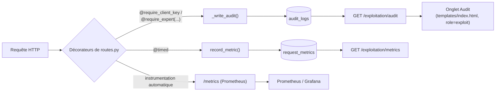

> Brouillon technique généré à partir du code du dépôt (`auth.py`,
> `routes.py`, `db.py`, `api/app.py`, `docs/incident.md`) — factuel et
> vérifiable. Structure organisée par compétence (C20, C21), conforme à
> la consigne du REAC. Voir [[rgpd]] pour le détail des mesures de
> protection des données et [[architecture]] pour la vue d'ensemble
> technique.

# Documentation technique — Monitorage et incident (E5)

## Objectif

Donner à l'équipe d'exploitation une visibilité sur la santé de la
plateforme (volume, latence, erreurs) et une traçabilité complète des
accès aux données (exigence RGPD), et démontrer la capacité à détecter,
diagnostiquer et corriger un incident réel via ce même monitorage.

---

## C20 — Monitorer une application d'IA

Trois mécanismes complémentaires, tous déclenchés depuis chaque requête :

### Métriques de performance maison (`request_metrics`)

- **Écriture** : décorateur `@timed` (`auth.py:370-388`), placé après les
  décorateurs d'authentification sur chaque route. Mesure la durée réelle
  (`time.perf_counter()`) et appelle `record_metric()` (`auth.py:238-264`)
  quel que soit le code retour.
- **Modèle** (`db.py:245-257`, table `request_metrics`) : `route`,
  `method`, `status_code`, `duration_ms`, `actor_type`, `actor_hint`
  (hint de clé API ou login expert — jamais la clé/le token en clair).
- **Exposition** : `GET /exploitation/metrics` (`routes.py:927-976`, rôle
  `exploit` uniquement) — agrège les `limit` dernières requêtes par
  route : nombre, taux d'erreur, p50/p95/moyenne de latence.

### Journal d'accès RGPD (`audit_logs`)

- **Écriture** : `log_audit()`/`_write_audit()` (`auth.py:187-235`),
  appelée explicitement dans chaque route sensible. Non bloquant : une
  erreur d'écriture d'audit est journalisée et absorbée, elle ne fait
  jamais échouer la requête métier.
- **Modèle** (`db.py:222-243`) : `timestamp`, `actor_type`, `actor_id`,
  `actor_role`, `ip_address` (pseudonymisée — voir [[rgpd]]), `action`,
  `resource_id`, `status_code`, `detail`. Immuable par convention
  applicative : aucune route DELETE/UPDATE n'existe sur cette table.
- **Exposition** : `GET /exploitation/audit` (rôle `exploit` strict — un
  `analyste` reçoit 403), paginée, filtrable. Interface dédiée
  (onglet "Audit", visible uniquement pour le rôle `exploit`) vérifiée en
  conditions réelles (navigateur headless) : les entrées réelles
  s'affichent avec IP pseudonymisée (ex. `127.0.0.xxx`).

### Stack Prometheus/Grafana (ajoutée cette session)

Ajoutée pour couvrir explicitement le collecteur/agrégateur/dashboard/
alertes à seuils attendus par C20, en complément (pas en remplacement) du
monitorage maison ci-dessus, qui reste utile pour la traçabilité RGPD par
requête que Prometheus ne couvre pas.

- **Exposition** : `GET /metrics` (`api/app.py`, via
  `prometheus_flask_exporter.PrometheusMetrics(app, group_by="endpoint")`)
  — format texte Prometheus natif, instrumente automatiquement toutes les
  routes existantes sans toucher `routes.py`. Vérifié en réel : après
  quelques requêtes contre un serveur local, `flask_http_request_total`
  et `flask_http_request_duration_seconds_bucket` remontent bien avec les
  labels `method`/`status`/`endpoint` attendus.
- **Collecteur** : `prometheus.yml` — scrape `vigieau:8080/metrics`
  toutes les 15s, charge les règles d'alerte via `rule_files`.
- **Alertes** (`monitoring/alert_rules.yml`, seuils explicites) :
  `TauxErreurEleve` (> 5 % de réponses 5xx sur 5 min) et
  `LatenceP95Elevee` (p95 > 2s sur 5 min), toutes deux avec `for: 2m`
  pour éviter les faux positifs sur un pic isolé. Évaluées nativement par
  Prometheus (visibles sur son UI `/alerts`), pas besoin d'Alertmanager
  pour que les seuils soient "configurés et fonctionnels".
- **Dashboard** : `monitoring/grafana/dashboards/dashboard.json`,
  provisionné automatiquement au démarrage de Grafana — requêtes/s par
  code retour, taux d'erreur, latence p50/p95, requêtes par endpoint.
- **Déploiement** : deux services ajoutés à `docker-compose.yml`
  (`prometheus`, `grafana`), images officielles, ports 9090/3000.

**Limite honnête sur la vérification** : tous les fichiers de config sont
syntaxiquement validés, et `/metrics` a été vérifié en conditions réelles
contre le serveur Flask local — mais **la stack complète
(`docker-compose up` avec Prometheus et Grafana réellement démarrés) n'a
pas pu être vérifiée de bout en bout dans cet environnement de
développement, Docker n'y étant pas disponible.** "La config est valide"
n'est pas la même chose que "je l'ai vu tourner" — à vérifier sur une
machine avec Docker avant la soutenance.

**Distinction avec C11** : ceci est du monitorage *applicatif* (volume,
latence, erreurs HTTP) — le monitorage du *modèle* (MLflow) est une
compétence distincte, voir [[rapport_e3]] C11. Le REAC signale lui-même
ce risque de confusion.

---

## C21 — Résoudre un incident technique et documenter la solution

`docs/incident.md` documente deux scénarios :

1. **Un scénario simulé** (OCR.space indisponible), conformément à la
   consigne du cahier des charges — utile comme exercice de méthodologie
   (détection → diagnostic → correction → leçons tirées), mais un
   incident *imaginé*, pas rencontré.
2. **Un scénario réel**, rencontré cette session en développant le
   monitorage Prometheus (C20) : `prometheus_flask_exporter` enregistre
   ses métriques dans le registre global `prometheus_client.REGISTRY` par
   défaut ; `create_app()` étant appelée plusieurs fois dans le même
   processus (une fois par fichier de test), le deuxième appel levait
   `ValueError: Duplicated timeseries in CollectorRegistry` — 61 tests en
   échec d'un coup. Corrigé en passant un `CollectorRegistry()` neuf à
   chaque appel de `create_app()` plutôt que de dépendre du registre
   global implicite.

**Preuve traçable dans l'historique Git**, pas seulement affirmée :
branche dédiée `fix/c21-prometheus-registry-collision`, créée depuis
`feature/c20-monitoring-prometheus-grafana` (donc après le commit qui
introduisait le bug) ; test de non-régression
(`tests/test_app_factory.py`) écrit et vérifié rouge avant le fix, vert
après ; fusionnée avec un vrai commit de merge, visible via
`git log --graph --all`. Déployée via la même CI applicative que le
reste du projet, pas de pipeline séparé pour ce fix. Détail complet
(logs, diagnostic pas à pas) : `docs/incident.md`.

**Point de vigilance sur le scénario simulé** — en vérifiant
`docs/incident.md` contre le code actuel, 3 détails illustratifs ont
dérivé de l'implémentation réelle depuis sa rédaction (nom de fonction
`extract_from_file` vs `extract_from_document`, réponse enrichie jamais
implémentée, nom d'action d'audit obsolète, commande de test qui ne
matche plus rien). Le scénario et la méthodologie restent valides ; ces
détails d'illustration mériteraient une correction séparée de
`docs/incident.md`, non faite ici pour ne pas modifier un livrable déjà
considéré terminé sans validation explicite.

---

## Tests

Aucun test dédié au monitorage maison lui-même (`record_metric`/
`log_audit` sont exercés indirectement par tous les tests d'intégration).
`tests/test_api.py` et `tests/test_non_regression.py` couvrent
`/exploitation/metrics` et `/exploitation/audit` (contrôle d'accès,
structure de réponse). `tests/test_accessibility.py` couvre l'onglet
Audit. `tests/test_app_factory.py` couvre spécifiquement la régression
C21 ci-dessus.

## Limites connues

- Alertes Prometheus définies et évaluées nativement, mais sans canal de
  notification configuré (email/Slack) — un seuil dépassé apparaît sur
  l'UI Prometheus, mais personne n'est notifié activement pour l'instant.
- Stack Prometheus/Grafana non vérifiée de bout en bout via
  `docker-compose up` dans cet environnement de développement (voir C20).
- `request_metrics` n'a pas de purge automatique (mentionnée comme piste
  dans `docs/roadmap.md`, non implémentée) — croissance illimitée de la
  table en usage prolongé.
- Le monitorage mesure la durée du traitement Flask ; il n'inclut pas la
  latence réseau côté client ni les appels sortants individuels
  (OCR.space, Claude, MLflow) en tant que métriques séparées.
