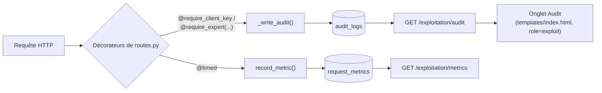

> Brouillon technique généré à partir du code du dépôt (`auth.py`,
> `routes.py`, `db.py`, `docs/incident.md`) — factuel et vérifiable. Voir
> [[rgpd]] pour le détail des mesures de protection des données et
> [[architecture]] pour la vue d'ensemble technique.

# Documentation technique — Monitorage et incident (E5)

## 1. Objectif

Donner à l'équipe d'exploitation une visibilité sur la santé de la
plateforme (volume, latence, erreurs) et une traçabilité complète des
accès aux données (exigence RGPD). Deux couches complémentaires : un
monitorage applicatif interne (journal RGPD + métriques agrégées maison,
§2) et depuis cette session une stack Prometheus/Grafana avec alertes à
seuils (§2.3) — la première ne remplace pas la seconde, elle couvre un
besoin différent (traçabilité par requête, pas juste des agrégats).

## 2. Architecture du monitorage

Deux mécanismes indépendants, tous deux déclenchés depuis `auth.py` et
alimentés par chaque requête :

### 2.1 Métriques de performance (`request_metrics`)

- **Écriture** : décorateur `@timed` (`auth.py:370-388`), placé après les
  décorateurs d'authentification sur chaque route. Mesure la durée réelle
  (`time.perf_counter()`) et appelle `record_metric()` (`auth.py:238-264`)
  quel que soit le code retour (succès ou erreur).
- **Modèle** (`db.py:245-257`, table `request_metrics`) : `route`,
  `method`, `status_code`, `duration_ms`, `actor_type`, `actor_hint`
  (hint de clé API ou login expert — jamais la clé/le token en clair).
- **Exposition** : `GET /exploitation/metrics` (`routes.py:927-976`, rôle
  `exploit` uniquement) — agrège les `limit` dernières requêtes (défaut
  5000, borné entre 100 et 50000) par route : nombre, taux d'erreur,
  p50/p95/moyenne de latence en millisecondes ; plus des KPIs globaux
  (clients actifs, total prélèvements/prédictions, taux de potabilité).

### 2.2 Journal d'accès RGPD (`audit_logs`)

- **Écriture** : `log_audit()`/`_write_audit()` (`auth.py:187-235`),
  appelée explicitement dans chaque route sensible (ex.
  `client_ingest_ocr`, `analyste_read_dashboard`, `exploitation_metrics`).
  Non bloquant : une erreur d'écriture d'audit est journalisée et absorbée
  (`except Exception`), elle ne fait jamais échouer la requête métier.
- **Modèle** (`db.py:222-243`, table `audit_logs`) : `timestamp`,
  `actor_type` (`client`/`expert`), `actor_id`, `actor_role`, `ip_address`
  (pseudonymisée — voir [[rgpd]]), `action`, `resource_id`, `status_code`,
  `detail`. Immuable par convention applicative : aucune route
  DELETE/UPDATE n'existe sur cette table.
- **Exposition** : `GET /exploitation/audit` (`routes.py:979` et
  suivantes, rôle `exploit` strict — un `analyste` reçoit 403), paginée,
  filtrable par `actor_type`, `actor_id`, `action` (recherche partielle).
- **Interface** : onglet "Audit" dédié dans `templates/index.html`, ajouté
  cette session (commit `54891db`) — visible uniquement pour le rôle
  `exploit`, vérifié en conditions réelles (navigateur headless) : les
  entrées réelles s'affichent avec IP pseudonymisée (ex. `127.0.0.xxx`).

### 2.3 Stack Prometheus/Grafana (monitorage applicatif type "métrique de système")

Ajoutée cette session pour couvrir C20 (collecteur/agrégateur/dashboard/
alertes à seuils) — distincte du monitorage de MODÈLE MLflow (C11, voir
[[mlops_pipeline]]) et distincte aussi du monitorage maison ci-dessus
(§2.1/2.2), qui reste utile pour la traçabilité RGPD par requête que
Prometheus ne couvre pas.

- **Exposition** : `GET /metrics` (`api/app.py`, via
  `prometheus_flask_exporter.PrometheusMetrics(app, group_by="endpoint")`)
  — format texte Prometheus natif, instrumente automatiquement toutes les
  routes existantes sans toucher `routes.py`. Vérifié en réel : après
  quelques requêtes contre un serveur local, `flask_http_request_total`
  et `flask_http_request_duration_seconds_bucket` remontent bien avec les
  labels `method`/`status`/`endpoint` attendus.
- **Collecteur** : `prometheus.yml` — scrape `vigieau:8080/metrics` toutes
  les 15s, charge les règles d'alerte via `rule_files`.
- **Alertes** (`monitoring/alert_rules.yml`, seuils explicites) :
  `TauxErreurEleve` (> 5% de réponses 5xx sur 5 min) et
  `LatenceP95Elevee` (p95 > 2s sur 5 min), toutes deux avec `for: 2m`
  pour éviter les faux positifs sur un pic isolé. Évaluées nativement par
  Prometheus (visibles sur son UI `/alerts`), pas besoin d'Alertmanager
  pour que les seuils soient "configurés et fonctionnels" — la
  notification (email/Slack) serait une étape suivante, non implémentée.
- **Dashboard** : `monitoring/grafana/dashboards/dashboard.json`,
  provisionné automatiquement au démarrage de Grafana (datasource +
  dashboard provisionnés par fichier, pas de clic-ops) — requêtes/s par
  code retour, taux d'erreur, latence p50/p95, requêtes par endpoint.
- **Déploiement** : deux services ajoutés à `docker-compose.yml`
  (`prometheus`, `grafana`), images officielles, ports 9090/3000.

**Limite honnête sur la vérification** : tous les fichiers de config
(`docker-compose.yml`, `prometheus.yml`, `monitoring/alert_rules.yml`,
les YAML/JSON de provisioning Grafana) sont syntaxiquement validés, et
`/metrics` a été vérifié en conditions réelles contre le serveur Flask
local — mais **la stack complète (`docker-compose up` avec Prometheus et
Grafana réellement démarrés) n'a pas pu être vérifiée de bout en bout
dans cet environnement de développement, Docker n'y étant pas
disponible.** Comme pour la CI applicative avant sa correction cette
session, "la config est valide" n'est pas la même chose que "je l'ai vu
tourner" — à vérifier sur une machine avec Docker avant la soutenance.

## 3. Fiche incident

`docs/incident.md` documente un scénario simulé (OCR.space indisponible),
conformément à la consigne du cahier des charges ("provoque ou simule un
incident technique réaliste"). Structure : détection (logs, métriques,
audit_logs) → diagnostic → correction/vérification → mise à jour du code
→ leçons tirées, avec un scénario secondaire (clé API invalide).

**Point de vigilance trouvé en vérifiant ce document contre le code
actuel** — 3 détails illustratifs ont dérivé de l'implémentation réelle
depuis sa rédaction :

| Détail cité dans `docs/incident.md` | Réalité actuelle du code |
|---|---|
| Fonction `extract_from_file(file_bytes, mime_type)` | `extract_from_document(file_bytes, mime)` (`ocr_service.py:194`) |
| Réponse enrichie de `ocr_provider`/`ocr_fallback` (§4, "amélioration post-incident") | Jamais implémenté — la réponse réelle est `{prelevement_id, ocr, prediction, prediction_possible}` |
| Action d'audit `"ingest_ocr"` | `"client_ingest_ocr"` / `"client_ingest_ocr_predict"` (`routes.py:503,558`) |
| Commande de non-régression `pytest tests/test_fonctionnels.py -k "ocr"` | Ne matche plus aucun test — ce fichier a été entièrement réécrit depuis (commit `5eae1ab`) |

Le scénario et la méthodologie restent valides ; ces détails d'illustration
mériteraient une correction séparée de `docs/incident.md` pour rester
alignés avec le code — non faite ici pour ne pas modifier un livrable déjà
considéré terminé sans validation explicite.

## 4. Tests

Aucun test dédié au monitorage lui-même (`record_metric`/`log_audit` sont
exercés indirectement par tous les tests d'intégration, qui passent par
des routes décorées `@timed`). `tests/test_api.py` et
`tests/test_non_regression.py` couvrent `/exploitation/metrics` et
`/exploitation/audit` (contrôle d'accès rôle `exploit`, structure de
réponse). `tests/test_accessibility.py` couvre l'onglet Audit (présence
`aria-live`, visibilité conditionnelle au rôle).

## 5. Limites connues

- Alertes Prometheus définies et évaluées nativement (§2.3), mais sans
  canal de notification configuré (email/Slack) — un seuil dépassé
  apparaît sur l'UI Prometheus, mais personne n'est notifié activement
  pour l'instant.
- Stack Prometheus/Grafana non vérifiée de bout en bout via
  `docker-compose up` dans cet environnement de développement (pas de
  Docker disponible) — voir §2.3 pour le détail de ce qui a été vérifié
  et de ce qui reste à confirmer.
- `request_metrics` n'a pas de purge automatique (mentionnée comme piste
  dans `docs/roadmap.md`, non implémentée) — croissance illimitée de la
  table en usage prolongé.
- Le monitorage mesure la durée du traitement Flask ; il n'inclut pas la
  latence réseau côté client ni les appels sortants individuels
  (OCR.space, Claude, MLflow) en tant que métriques séparées — seule la
  durée totale de la route est mesurée.
