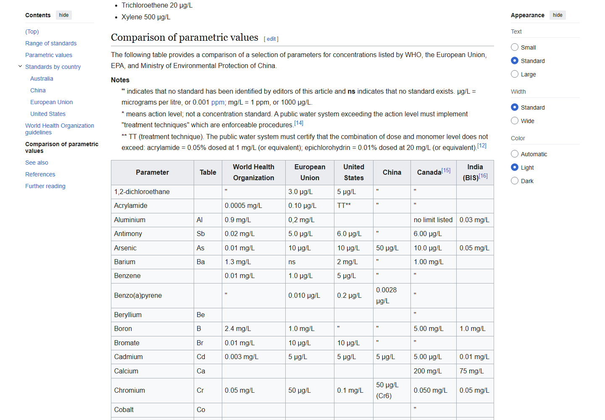
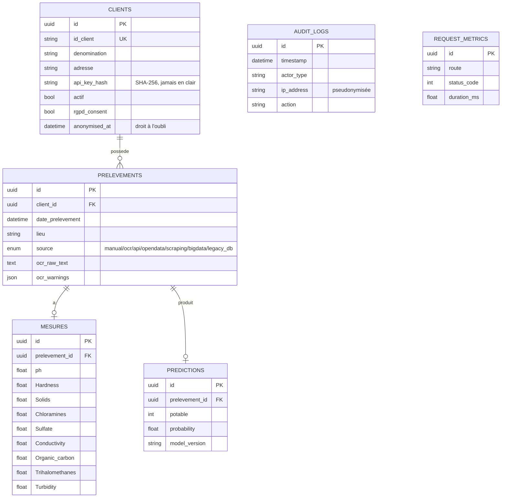

> Structure organisée **par compétence** (C1 à C5), conformément à la
> consigne du REAC ("faites correspondre votre plan à celui du REAC.
> Découpez par compétence, sans chercher forcément à raconter une
> histoire") plutôt qu'en contexte/démarche/résultats.

# Rapport professionnel — E1 : Collecte, stockage et mise à disposition des données

**Dépôt du projet (public)** : https://github.com/ali-bousrira/VigiEau

## Présentation du projet

VigiEau centralise le suivi de la qualité de l'eau pour des collectivités
territoriales (communes, syndicats des eaux) : chaque prélèvement
(mesures physico-chimiques d'un point d'eau) doit pouvoir être déposé,
stocké de façon conforme au RGPD, et restitué à la fois au client qui l'a
soumis et aux experts qui supervisent la plateforme.

- **Acteurs** : le client final (dépose ses prélèvements, consulte ses
  propres résultats), l'analyste qualité (vue globale, tableaux de bord),
  le responsable d'exploitation (supervision technique, gestion des
  comptes clients) — détail des parcours dans [[user_stories]].
- **Objectifs fonctionnels** : centraliser des données hétérogènes issues
  de 5 types de sources différents, les rendre exploitables pour la
  prédiction de potabilité, les exposer via une API documentée et
  sécurisée.
- **Objectifs techniques** : chaîne complète extraction → nettoyage/
  harmonisation → modélisation conforme (Merise) → mise à disposition API.
- **Environnement** : Python/Flask, SQLAlchemy 2.0, SQLite en
  développement (PostgreSQL visé en production, bascule via
  `DATABASE_URL` — voir C4).
- **Contraintes** : conformité RGPD dès la modélisation (voir [[rgpd]]),
  API versionnée et documentée (OpenAPI), traçabilité des accès.
- **Budget** : les 5 sources d'extraction retenues (C1) sont toutes
  gratuites — API publique Hub'Eau, page Wikipédia publique, CSV Kaggle
  déjà local, base légataire auto-seedée — coût d'infrastructure nul pour
  ce bloc. Le seul poste réellement payant du projet (repli OCR Claude
  Vision au-delà du quota gratuit OCR.space) est chiffré et arbitré
  séparément, voir [[doc_technique_e2]] C7.
- **Organisation du travail** : projet individuel (certification RNCP
  37827), historique Git avec commits atomiques et, depuis cette session,
  un usage réel de branches de fonctionnalité fusionnées avec de vrais
  commits de merge (voir C1 et [[doc_technique_e5]] pour C21).

---

## C1 — Automatiser l'extraction des données

Le REAC exige 5 types de source distincts : API web, scraping, fichier,
base de données, système big data — pas juste "plusieurs sources
hétérogènes" au sens large.

| Source | Type REAC | Mécanisme | Volume | Fichier |
|---|---|---|---|---|
| Fiche laboratoire (OCR) | Fichier | `POST /ingest/ocr(-and-predict)` — image/PDF → extraction structurée | 1 fiche par appel | `ocr_service.py` (détail : [[doc_technique_e2]]) |
| API ouverte Hub'Eau | API web | `scripts/ingest_hubeau.py` — import automatisé, hors requête HTTP | 11 prélèvements réels (vrai appel réseau, commune de Paris) | contrôle sanitaire officiel de l'eau potable |
| Comparaison Wikipédia des normes | Scraping | `scripts/ingest_scraping.py` — table HTML réelle, valeurs limites par organisme (OMS, UE, Inde...) | 3 organismes exploitables (European Union, Canada, India (BIS)), mesuré via `--dry-run` réel | `en.wikipedia.org/wiki/Drinking_water_quality_standards` |
| Ancien système départemental | Base de données | `scripts/ingest_legacy_db.py` — SQLite, schéma et format de date propres à ce système | 4 relevés (table `releves_qualite_eau`) | `legacy_system.db` (généré par `scripts/seed_legacy_db.py`) |
| Jeu Kaggle via DuckDB/Parquet | Big data | `scripts/ingest_bigdata_duckdb.py` — CSV converti en Parquet, requêté via DuckDB | 3276 lignes (fichier source complet) | `water_potability.csv` (déjà utilisé pour l'entraînement) |

Colonne Volume ajoutée conformément au conseil du REAC pour C1 ("volume
taille — en nb de lignes obtenues ou en taille de fichier"), avec des
chiffres mesurés en direct plutôt qu'estimés — y compris un nouveau run
réseau réel du scraping. À l'exécution, `ingest_legacy_db.py --dry-run`
affiche `features manquantes : aucune` pour les 4 relevés — preuve en
ligne de commande de l'affirmation déjà faite en C3 ("la seule des 5
sources qui couvre les 9 features sans exception").

Chaque script est autonome, versionné sur Git, gère ses erreurs (réseau,
fichier source absent, valeur non numérique) sans lever d'exception non
gérée, et s'exécute en mode `--dry-run` pour prévisualiser avant
d'insérer. Un test dédié par source (`tests/test_ingest_*.py`) couvre le
mapping et l'idempotence — un second import du même lot ne duplique rien.

Sur la saisie API directe (`POST /ingest/manual`) : elle reste dans
l'application (c'est le canal principal utilisé par un client réel), mais
je ne la compte plus parmi les 5 sources d'*extraction* du REAC — recevoir
un dépôt poussé par un client n'est pas la même chose qu'aller chercher
la donnée à sa source, même si le code et le schéma cible sont partagés.

Pour le scraping, j'avais d'abord écarté cette piste (préférant une API
publique, moins fragile face aux changements de mise en page) — mais le
REAC demande explicitement les 5 types, scraping inclus, donc je l'ai
ajouté malgré cette réserve initiale plutôt que de la contourner.

**Page source réelle du scraping** (`en.wikipedia.org/wiki/Drinking_water_quality_standards`,
section "Comparison of parametric values") — `scripts/ingest_scraping.py`
parse cette table HTML directement, colonne par organisme normatif :



**Difficulté — le mapping Hub'Eau n'a pas de solution parfaite.** Le jeu
de données Kaggle qui a servi à entraîner le modèle et le contrôle
sanitaire français ne mesurent tout simplement pas les mêmes paramètres.
`Chloramines` s'approxime tant bien que mal par le chlore total mesuré
(un proxy, pas une équivalence chimique — je le note explicitement pour
ne pas laisser croire à une correspondance propre), mais `Solids`
(matières dissoutes totales) n'a purement et simplement aucun équivalent
suivi en France : cette feature reste `None` pour toute donnée Hub'Eau,
ce qui limite mécaniquement les prédictions automatiques sur cette
source. J'ai vérifié cette limite par un vrai appel réseau plutôt que de
la déduire de la documentation Hub'Eau, pour être sûr de ne pas affirmer
une correspondance que je n'avais pas réellement observée.

**Difficulté — étendre le schéma sans casser l'existant.** Ajouter
`IngestionSource.SCRAPING`/`BIGDATA`/`LEGACY_DB` à l'énumération
existante avait l'air trivial. Sauf que SQLite grave la contrainte
`CHECK` d'une colonne `Enum` au moment de la création de la table — une
base déjà initialisée avec l'ancienne énumération refuse silencieusement
la nouvelle valeur tant qu'elle n'est pas recréée. Point à surveiller à
chaque nouvelle évolution de ce type d'énumération.

---

## C2 — Requêter des données en SQL

Les requêtes utilisées viennent réellement des routes analyste/exploit,
pas d'exemples isolés écrits pour ce rapport.

**Requête filtrée avec jointure** (`routes.py:822-860`,
`GET /analyste/prelevements`) : filtre combiné client + source + plage de
dates, puis jointure conditionnelle sur `Prediction` avec `.distinct()`
pour éviter les doublons introduits par le join :

```python
q = q.filter(Prelevement.client_id == c.id)
q = q.filter(Prelevement.source == request.args["source"])
q = q.filter(getattr(Prelevement.date_prelevement, op)(dt))   # date_from / date_to
q = q.join(Prediction).filter(Prediction.potable == int(request.args["potable"])).distinct()
```

**Requête d'agrégation** (`routes.py:921-949`, `GET /analyste/dashboard`) :
moyennes multi-colonnes et regroupement par source, sans charger les
lignes en Python :

```python
avgs = db.query(
    func.avg(Mesure.ph), func.avg(Mesure.turbidity),
    func.avg(Mesure.conductivity), func.avg(Mesure.chloramines),
    func.avg(Mesure.hardness),
).one()

sources = dict(
    db.query(Prelevement.source, func.count(Prelevement.id))
      .group_by(Prelevement.source).all()
)
```

**Conscience des coûts** : les colonnes réellement filtrées en permanence
sont indexées (`db.py`) — `id_client`, `api_key_hash`, les clés
étrangères `client_id`/`prelevement_id`, `timestamp` et `actor_id` sur
`audit_logs`, `route` sur `request_metrics`. Toutes les routes de listing
sont paginées (`page`/`per_page`, voir C5) pour éviter de charger une
table entière en mémoire — pas de `SELECT *` implicite côté ORM, chaque
requête ne sélectionne que les colonnes utilisées par son usage.

**Requêtes n+1, mesurées et root-causées, pas juste évoquées** —
`_prev_dict()` (`routes.py:161-186`) accède à `p.client`, `p.mesures`,
`p.predictions` par ligne, sans `joinedload`/`selectinload` nulle part
dans le dépôt. Mesuré en conditions réelles (event SQLAlchemy
`before_cursor_execute` sur un vrai appel `GET /analyste/prelevements`,
via le client de test Flask) : **14 requêtes SQL pour 3 lignes, 35 pour
10**. La cause n'est pas juste l'absence d'eager loading : `log_audit()`
(`routes.py:858`) appelle `_write_audit()` (`auth.py:187-211`), qui fait
`db.commit()` **sur la même session** que celle qui vient de charger la
liste, **avant** la boucle de sérialisation (`routes.py:860`). Avec
`expire_on_commit=True` (comportement par défaut de SQLAlchemy), ce
commit expire tous les objets déjà chargés — chaque accès d'attribut
ensuite redéclenche un `SELECT ... WHERE id = ?` par ligne, en plus des
lazy loads `mesures`/`predictions`/`client`.

**`EXPLAIN QUERY PLAN` réel** (sqlite3, contre le schéma actuel) — un
contraste assumé plutôt qu'une réussite généralisée :

```
-- GET /analyste/prelevements (filtre client + date)
SEARCH prelevements USING INDEX ix_prev_client_date
  (client_id=? AND date_prelevement>? AND date_prelevement<?)
USE TEMP B-TREE FOR ORDER BY   -- created_at n'est pas dans l'index

-- GET /analyste/dashboard (GROUP BY source)
SCAN prelevements                 -- pas d'index sur `source`
USE TEMP B-TREE FOR GROUP BY
```

La requête filtrée utilise bien l'index composite `ix_prev_client_date`
(`db.py:169`) ; l'agrégation par source du dashboard, elle, scanne la
table entière — un choix non corrigé pour l'instant (volume actuel trop
faible pour le justifier), documenté ici plutôt que caché.

---

## C3 — Créer des règles d'agrégation de données issues de différentes sources

Chaque source alimente le **même schéma cible** (`Prelevement` + `Mesure`,
9 features physico-chimiques), quelle que soit son origine — c'est là que
se joue l'essentiel de l'harmonisation :

- OCR : normalisation des nombres (virgule → point), champs manquants ou
  douteux marqués en `warnings` plutôt que devinés (`ocr_service.py::_normalise`).
- Hub'Eau : résultats bruts groupés par `code_prelevement` (un prélèvement
  physique = plusieurs lignes, une par paramètre mesuré), puis pivotés
  vers les 9 features attendues via `scripts/ingest_hubeau.py::PARAM_MAP`.
- Scraping : les valeurs limites réglementaires ne sont pas des mesures de
  terrain — nature différente, assumée dans le champ `lieu` ("Valeurs
  limites — [organisme]") plutôt que masquée. Les classifications floues
  ("0–75 mg/L = soft") sont explicitement ignorées plutôt que converties
  en un nombre inventé (`scripts/ingest_scraping.py::_extract_number`).
- Base légataire : noms de colonnes et format de date (`DD/MM/YYYY`)
  propres à cet ancien système, harmonisés vers le schéma cible et l'ISO
  8601 (`scripts/ingest_legacy_db.py`) — la seule des 5 sources qui
  couvre les 9 features sans exception.
- Big data : les colonnes du CSV Kaggle correspondent déjà aux 9 features
  attendues — l'harmonisation porte ici sur le *format* (CSV → Parquet →
  requêtage DuckDB) plutôt que sur les noms de colonnes.
- Dans tous les cas, un prélèvement est stocké **même si des mesures
  manquent** (`prediction_possible=false` plutôt qu'un rejet) : je
  privilégie la conservation de la donnée partielle à sa perte.

**Exemple réel de règle d'agrégation — harmonisation de la base
légataire** (`scripts/ingest_legacy_db.py:74-117`), noms de colonnes et
format de date propres à l'ancien système, reprojetés vers le schéma
cible :

```python
COLUMN_MAP = {
    "acidite":               "ph",
    "durete_totale":          "Hardness",
    "matieres_dissoutes":     "Solids",
    "chlore_combine":         "Chloramines",
    "sulfates":               "Sulfate",
    "conductivite":           "Conductivity",
    "carbone_organique":      "Organic_carbon",
    "trihalomethanes_totaux": "Trihalomethanes",
    "turbidite":              "Turbidity",
}

def _parse_date_fr(date_str: str) -> str | None:
    """DD/MM/YYYY (format du système legacy) -> YYYY-MM-DD (ISO)."""
    ...

for legacy_col, feature in COLUMN_MAP.items():
    value = row.get(legacy_col)
    if value is not None:
        mesures[feature] = value
missing = [f for f in FEATURES if mesures[f] is None]
```

Le principe est le même dans les 5 scripts d'ingestion : une table de
correspondance explicite (jamais de déduction implicite par position de
colonne), et une liste de features manquantes calculée et propagée
plutôt que masquée.

**Difficulté — le scraping m'a fait rater une feature d'une façon que je
n'avais pas vue venir.** Je cherchais la ligne "pH" dans la table
Wikipédia par une simple sous-chaîne, sans penser que "ph" apparaît aussi
tel quel à l'intérieur de "sul**ph**ate" — la valeur de sulfate écrasait
silencieusement la vraie valeur de pH pour les organismes qui avaient les
deux. Aucun message d'erreur, juste une donnée fausse. Je ne l'ai vu
qu'en écrivant un test qui vérifie explicitement les deux valeurs côte à
côte, pas en relisant le code — corrigé en cherchant "ph" en frontière de
mot plutôt qu'en sous-chaîne. Fiche complète (branche, test, correction) :
voir [[doc_technique_e5]] et `docs/incident.md`.

---

## C4 — Modéliser les données en DB, en respectant le RGPD

Le MCD/MPD complet est dans [[mcd]] (formalisme Merise, conformément à
l'exigence de certification, rédigé avant toute implémentation SQL) ;
schéma repris ici tel qu'il correspond au code actuel (`db.py`), 5
entités métier plus les 2 tables techniques :



`source` a grandi depuis la première version du schéma : 4 valeurs à
l'origine (`manual`/`ocr`/`api`/`opendata`), 3 ajoutées avec les
nouvelles sources d'extraction du C1 ci-dessus (`scraping`/`bigdata`/
`legacy_db`) — le diagramme ci-dessus reflète l'énumération actuelle de
`db.py`, pas la version d'origine. `audit_logs` et `request_metrics`
n'ont volontairement aucune clé étrangère : ce sont des journaux
indépendants du cycle de vie des autres entités (un client supprimé ne
doit pas faire disparaître son historique d'accès).

- **SQLAlchemy 2.0** plutôt qu'un ORM plus lourd : le schéma est simple
  (5 entités métier), pas besoin de fonctionnalités avancées.
- **SQLite en développement, PostgreSQL visé en production** — bascule
  prévue via `DATABASE_URL` mais pas encore finalisée (voir `README.md`,
  section Limites connues).
- **Une seule `Mesure` par `Prelevement`** (`uselist=False` dans
  `db.py`), mais **plusieurs `Prediction` possibles par `Prelevement`**
  au niveau du schéma (pas de contrainte d'unicité) — en pratique,
  l'application n'en crée jamais qu'une seule par prélèvement (l'endpoint
  `POST /predict` autonome ne persiste rien). C'est une nuance que
  `docs/mcd.md` simplifie en "1:1" ; je le précise ici pour rester exact.
- **RGPD by design** : clé API hashée SHA-256 (jamais en clair), IP
  pseudonymisée dans les journaux, droit d'accès et d'effacement exposés
  via `/me/rgpd` — détail complet dans [[rgpd]]. Les données stockées
  (dénomination, adresse d'une collectivité) relèvent plus du B2B que du
  personnel au sens strict, mais je les ai traitées avec les mêmes
  garanties par précaution plutôt que de trancher moi-même leur statut.

**Difficulté — un blocage bête, mais avec un vrai impact.** `docs/` était
resté dans `.gitignore` depuis la création du dépôt. Toute la
documentation — MCD, RGPD, user stories — existait donc uniquement en
local, jamais partagée, alors que la certification exige explicitement
que ces livrables vivent dans `docs/`, versionnés comme le reste du
projet. Personne ne l'avait remarqué parce que "ça marchait" en local :
c'est en croisant le dépôt réel avec les exigences de certification que
le problème m'a sauté aux yeux. Correction triviale une fois vue, mais un
bon rappel que ce qui tourne sur ma machine ne veut rien dire tant que ce
n'est pas partagé.

---

## C5 — Développer une API mettant à disposition le jeu de données

L'API expose les données via des routes REST documentées en OpenAPI
(`swagger.yaml`, accessible sur `/apidocs`), avec un contrôle d'accès par
clé API pour les clients et par token Bearer (rôles `analyste`/`exploit`)
pour les experts. Toutes les routes de listing sont paginées
(`page`/`per_page`) pour rester exploitables à volume réel.

- Dépôt : `POST /ingest/manual`, `/ingest/ocr(-and-predict)`.
- Consultation filtrée : `GET /me/prelevements`,
  `GET /analyste/prelevements` (filtres `client_id`, `source`, `date`,
  `potable` — voir C2), détail par ID.
- Gestion des comptes clients (rôle expert) : `GET/POST /admin/clients`,
  `GET/PUT/DELETE /admin/clients/<id>`, `POST /admin/clients/<id>/apikey`.
- Suppression d'un prélèvement : `DELETE /analyste/prelevements/<id>`
  (rôle `exploit` uniquement, confirmation explicite requise dans le
  corps de la requête — cohérent avec le pattern déjà utilisé par
  `DELETE /me/rgpd`).
- Export RGPD : `GET/DELETE /me/rgpd`.

**CRUD par ressource, et un choix assumé plutôt qu'un oubli** :
`clients` a désormais son cycle complet (liste, détail, création,
édition, suppression), mais la suppression d'un client est **refusée
(409)** s'il a au moins un prélèvement associé — dans ce cas,
`DELETE /me/rgpd` (anonymisation) est la voie appropriée, pas la
destruction pure et simple d'un historique réel. `prelevements` n'a pas
de `POST`/`PUT` génériques en dehors des routes d'ingestion dédiées
(`/ingest/*`, qui jouent ce rôle de création) ; la suppression, elle,
existe et est délibérément restreinte au rôle `exploit` — plus
destructrice que la lecture, elle n'a pas le même filet de sécurité que
l'anonymisation RGPD des clients.

---

## Résultats globaux

- API Data opérationnelle : 5 sources d'extraction + dépôt direct,
  consultation filtrée, détail par ID, export RGPD.
- `scripts/ingest_hubeau.py` testé en conditions réelles : 11 prélèvements
  réels récupérés sur un vrai appel à l'API Hub'Eau (commune de Paris).
- Documentation OpenAPI complète et accessible sur `/apidocs`.
- Suite de tests : 234 tests passants (`pytest tests/ -v`, relevé à la
  date de ce rapport), dont une suite par source d'extraction
  (`tests/test_ingest_hubeau.py`, `test_ingest_scraping.py`,
  `test_ingest_legacy_db.py`, `test_ingest_bigdata_duckdb.py`) couvrant
  mapping, conversion d'unité/format et idempotence.
