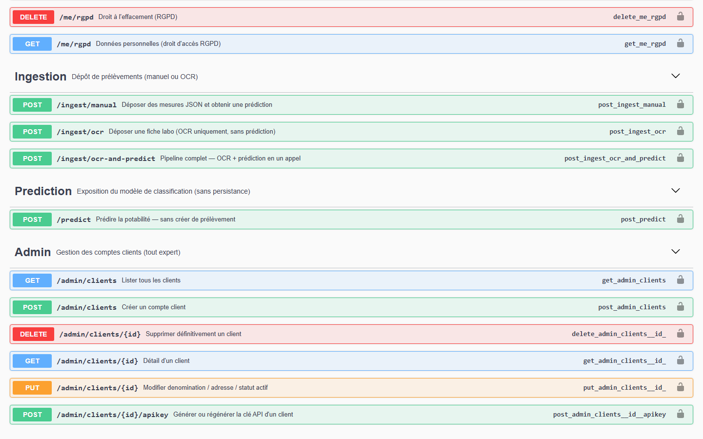
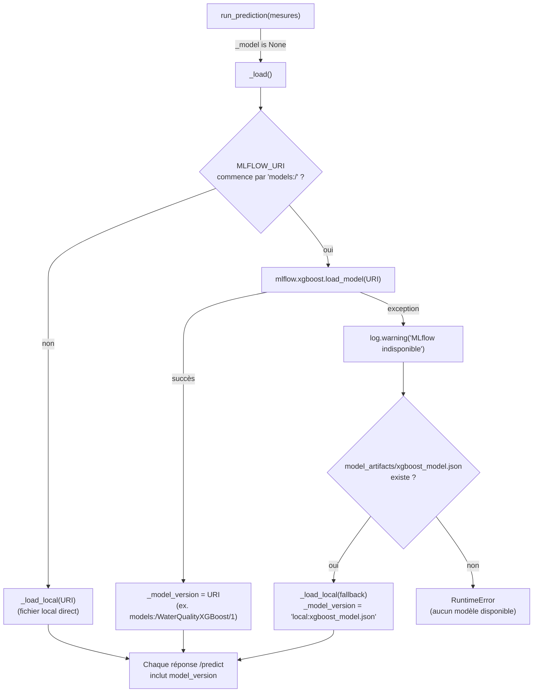
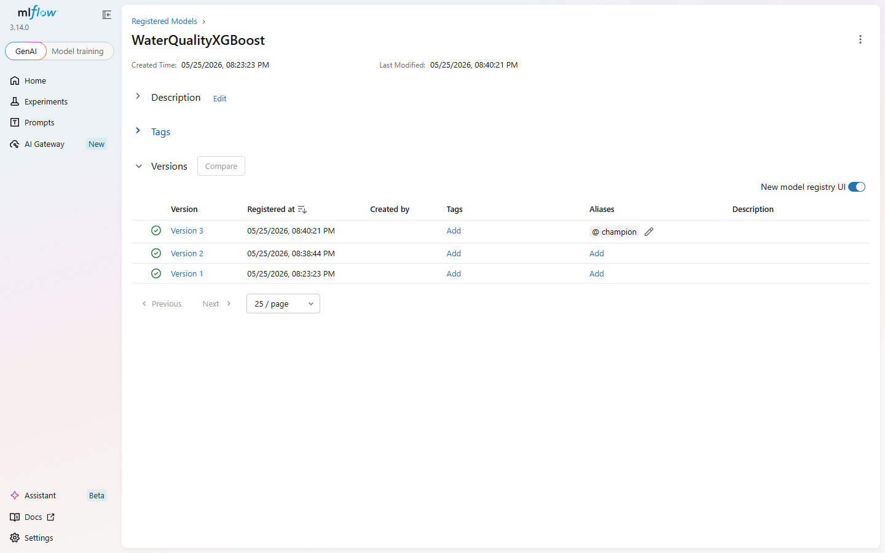
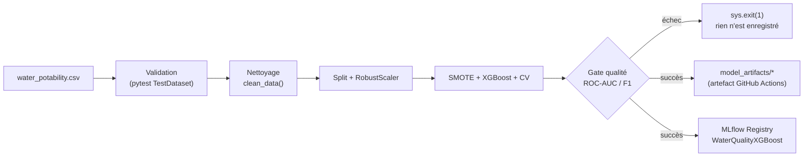

# Rapport professionnel — E3 : Modèle en production

**Dépôt du projet (public)** : https://github.com/ali-bousrira/VigiEau

## Contexte

Le modèle de classification de la potabilité (XGBoost, entraîné sur le
jeu de données Waterflow d'origine) doit être exposé de façon fiable dans
l'application, tracé (quelle version a produit quelle prédiction), et
ré-entraînable/validable sans intervention manuelle — le versant
dev/ML du projet chef-d'œuvre, dont le versant gestion de projet est
couvert par [[rapport_e4]] (même code, même dépôt, deux angles de
compétences distincts).

---

## C9 — Développer une API exposant un modèle d'IA

Cette compétence évalue la partie API (auth, tests, documentation), pas
le modèle lui-même — voir C11 pour le monitorage du modèle.

- **Endpoint** : `POST /predict` (`routes.py`) — accepte des mesures
  brutes ou un `prelevement_id` existant, retourne la prédiction sans
  rien persister (endpoint de test/consultation, distinct du pipeline
  d'ingestion qui, lui, persiste).
- **Authentification** : `@require_client_key` ou `@require_expert()`
  selon le contexte d'appel — mêmes décorateurs que le reste de l'API,
  pas de mécanisme d'auth séparé pour cette route.
- **Tests** : `tests/test_unitaires.py` (validation des features, scaling,
  prédiction) et `tests/test_api.py` (auth, codes retour) — modèle et
  scaler mockés pour ne dépendre d'aucun artefact réel en CI.
- **OWASP** : le service applique les mêmes protections que le reste de
  l'API — aucune injection SQL possible (requêtes 100% paramétrées via
  l'ORM), et une revue de sécurité menée cette session sur l'ensemble du
  dépôt a corrigé une XSS stockée dans le rendu du journal d'audit
  (`templates/index.html`) qui aurait pu affecter un expert consultant
  des données issues, indirectement, d'un appel à ce type d'endpoint —
  détail dans [[doc_technique_e5]].

**Deux modes d'appel** (`routes.py:578-617`) — mesures brutes, ou
`prelevement_id` d'un prélèvement déjà en base (auquel cas les mesures
sont relues et re-projetées vers les 9 features du modèle) :

```python
@bp.route("/predict", methods=["POST"])
@require_client_key
@timed
def predict():
    data = request.get_json(force=True) or {}
    if "prelevement_id" in data:
        prev = g.db.query(Prelevement).filter(Prelevement.id == data["prelevement_id"]).first()
        if prev.client_id != g.client.id:
            return jsonify({"error": "Accès refusé."}), 403
        mesures = prev.mesures.to_feature_dict()
    else:
        mesures = data
    result = run_prediction(mesures)   # ValueError → 400 si features manquantes
    ...
```

Ne persiste rien — c'est un endpoint de consultation/test, à distinguer de
`POST /ingest/manual` et `POST /ingest/ocr-and-predict` qui, eux,
créent le `Prelevement` et la `Prediction` associée (voir [[rapport_e1]]
C3).

**Critères REAC couverts, point par point** :

| Critère REAC (C9) | Preuve |
|---|---|
| Endpoint qui expose le modèle | `POST /predict`, `routes.py:578-617` |
| Authentification | `@require_client_key` (clé API client, même mécanisme que le reste de l'API) |
| Tests automatisés | `tests/test_unitaires.py` (features/scaling/prédiction), `tests/test_api.py` (auth, codes retour) |
| Documentation | `swagger.yaml` (`/predict`), accessible sur `/apidocs` — voir capture ci-dessous |
| Sécurité (OWASP) | Requêtes paramétrées (ORM), XSS stockée corrigée cette session (détail [[doc_technique_e5]]) ; contrôle d'accès cross-client (BOLA, voir ci-dessous) |



**Corrections apportées en relisant ce rapport contre le code réel** —
deux écarts trouvés en auditant cette section après une première
rédaction, corrigés plutôt que simplement documentés :

1. `swagger.yaml` ne documentait en réalité **pas** `/predict` (aucun
   bloc `/predict:`, vérifié par `grep`) alors que cette section
   l'affirmait comme preuve du critère "Documentation" — corrigé en
   ajoutant le bloc complet (tag dédié `Prediction`, schémas de requête à
   deux modes, les 6 réponses réellement possibles). La capture
   ci-dessus est prise après correction, pas avant.
2. `tests/test_api.py::test_predict_id_autre_client_refuse` — censé
   prouver le contrôle d'accès cross-client (protection OWASP API1:2023,
   Broken Object Level Authorization, `routes.py:603-604`) — utilisait en
   réalité une clé API jamais enregistrée : la requête échouait en 401
   dès l'authentification, sans jamais atteindre le code qu'il prétendait
   tester. Réécrit pour créer un vrai second client via l'API admin et
   vérifier le 403 réel.

Les deux étaient des écarts vérifiables entre ce que le rapport affirmait
et ce que le code faisait — le genre d'incohérence qu'un jury peut
détecter en ouvrant `/apidocs` ou en relisant un test en direct.

---

## C10 — Intégrer l'API d'un modèle ou d'un service d'IA tiers

Ici on intègre une API tierce, pas celle qu'on développe soi-même (C9) —
c'est le service OCR (OCR.space + Claude Vision en repli), détaillé côté
veille/paramétrage dans [[doc_technique_e2]] (C6-C8). Cette section se
concentre sur ce que C10 demande spécifiquement : tests sur le service
intégré, et gestion du renouvellement d'authentification.

- **Tests spécifiques à l'intégration** : `tests/test_e2e.py` (10 tests,
  pipeline complet via le service tiers mocké) et 2 tests d'erreur dans
  `tests/test_api.py` — aucun appel réseau réel en CI, cohérent avec le
  reste du projet.

**Limite honnête sur le renouvellement d'authentification** : les clés
`OCR_SPACE_API_KEY`/`ANTHROPIC_API_KEY` sont des clés statiques en
variable d'environnement, sans mécanisme de rotation automatisée dans le
code — un renouvellement se ferait aujourd'hui manuellement (régénérer la
clé chez le fournisseur, mettre à jour le secret de déploiement,
redémarrer). C'est une limite assumée plutôt qu'un mécanisme à inventer
pour ce rapport : la configuration par variable d'environnement rend au
moins la rotation opérationnellement simple, même sans automatisation
applicative.

---

## C11 — Monitorer un modèle d'IA (MLOps)

Monitorage du *modèle*, pas de l'application (ça, c'est C20 — voir
[[doc_technique_e5]], attention à ne pas confondre les deux comme le
REAC le signale lui-même).

- **Registre MLflow** : `predict_service.py` charge le modèle en priorité
  depuis le Model Registry (`MLFLOW_URI=models:/WaterQualityXGBoost/1`),
  avec repli automatique sur un fichier XGBoost local
  (`model_artifacts/xgboost_model.json`) si le registre est indisponible
  — chargement **paresseux** (au premier appel, pas à l'import).
- **Traçabilité par prédiction** : chaque réponse de `/predict` inclut
  `model_version`, ce qui trace précisément quelle version du modèle a
  produit quelle prédiction stockée — sans ce champ, impossible de savoir
  a posteriori quel modèle est responsable d'un résultat donné.

**Chaîne de chargement et de repli** (`predict_service.py::_load()`),
déclenchée une seule fois, au premier appel à `run_prediction()` :



Ce repli a été vérifié réellement, pas seulement lu dans le code : en
coupant le backend MLflow (`MLFLOW_TRACKING_URI` invalide), le service
bascule bien sur `model_artifacts/xgboost_model.json` et
`model_version` passe de `models:/WaterQualityXGBoost/1` à
`local:xgboost_model.json` dans la réponse — la traçabilité reste
correcte même en mode dégradé.

**Registre MLflow réel, tel que consulté cette session** — 3 versions
enregistrées de `WaterQualityXGBoost`, la version 3 aliasée `champion`
(alias utilisé manuellement pour l'instant, voir limite ci-dessous) :



- **Limite connue** : pas de dashboard dédié au monitorage de modèle
  (type Dash/Streamlit) au-delà de l'UI MLflow elle-même — suffisant pour
  ce projet, documenté comme limite plutôt que comme fonctionnalité.
  Autre limite, partagée avec C13 : le registre ci-dessus est local à
  cette machine de développement (gitignored) — un runner CI repart d'un
  registre vide, voir C13.

---

## C12 — Programmer les tests automatisés d'un modèle d'IA

- `tests/test_train_model.py` : pipeline d'entraînement sur données
  synthétiques, hyperparamètres réduits, MLflow mocké.
- `tests/test_unitaires.py` : validation des features, scaling, prédiction.

**Couverture de tests, mesurée honnêtement** : la commande CI mesurait
initialement `pytest --cov=api`, qui ne couvre que les fichiers de
ré-export `api/` (quelques lignes chacun, voir [[architecture]] pour le
détail de ce découpage racine/`api/`), pas la logique réelle — ce
flag a été corrigé depuis (`.github/workflows/ci.yml:46-48`) pour
pointer sur les 5 modules qui contiennent vraiment le code. Relevé
directement en local avec la commande exacte de la CI, à la date de ce
rapport :

| Module | Instructions | Couverture | Non couvert |
|---|---|---|---|
| `db.py` | 125 | **97 %** | 4 lignes (bloc de repli rarement atteint) |
| `routes.py` | 427 | **88 %** | principalement des branches d'erreur peu probables |
| `auth.py` | 126 | **83 %** | quelques chemins d'erreur d'auth |
| `predict_service.py` | 57 | **54 %** | `_load()`/`_load_local()` — le chemin MLflow réel n'est pas exercé en CI (modèle mocké, voir C9) |
| `ocr_service.py` | 96 | **21 %** | `_ocr_space`/`_claude_vision_extract` — aucun appel réseau réel en CI (voir C10) |
| **Total pondéré** | **831** | **78 %** | |

Les deux modules les moins couverts (`predict_service.py`,
`ocr_service.py`) le sont par choix assumé, pas par oubli : ce sont
précisément les points d'intégration avec des services externes
(MLflow, OCR.space, Claude Vision) qu'on ne veut pas appeler réellement
depuis une CI publique — testés via des mocks ciblés
(`tests/test_e2e.py`, `tests/test_unitaires.py`) plutôt que masqués.

**Asymétrie assumée avec le gate du modèle (C13)** : `ci.yml` mesure,
affiche et publie la couverture (`--cov-report=term-missing`,
`--cov-report=xml`) mais ne passe jamais `--cov-fail-under` — un build ne
peut donc pas échouer sur ce critère seul. À contraster avec
`model-ci.yml`, qui gate numériquement le modèle (`--min-roc-auc 0.82
--min-f1 0.65`, voir C13) : la couverture de code est un indicateur
suivi, pas (encore) un seuil bloquant.

---

## C13 — Développer la CI d'un modèle d'IA

`.github/workflows/model-ci.yml`, séparé de la CI applicative
(déclencheur différent : push sur `water_potability.csv`,
`scripts/train_model.py` ou `requirements.txt`, ou déclenchement manuel).
Détail complet de chaque étape dans [[mlops_pipeline]] ; ce qui suit se
concentre sur ce que C13 demande spécifiquement : la chaîne automatisée
et sa preuve d'exécution réelle.



L'entraînement du modèle ne déclenche pas automatiquement un déploiement
de celui-ci — un choix assumé, pas un oubli : le job `deploy` de la CI
applicative (`ci.yml`) et le registre MLflow sont deux mécanismes
séparés, cohérent avec la limite déjà documentée dans
[[mlops_pipeline]] sur l'absence de registre MLflow persistant en CI.

**Pipeline exécuté en conditions réelles** (pas seulement en test) :

| Métrique | Valeur obtenue | Référence historique | Seuil du gate |
|---|---|---|---|
| Accuracy | 0.7912 | — | — (informative) |
| F1 | 0.7329 | ≈ 0.73 | ≥ 0.65 |
| ROC-AUC | 0.8744 | ≈ 0.8765 | ≥ 0.82 |

Cohérent avec le modèle actuellement déployé — l'écart entre la
référence historique et le run réel (0.8744 vs 0.8765) est de l'ordre de
la variance normale d'un ré-entraînement (SMOTE et le split
train/validation sont stochastiques), pas une régression.

**Vu tourner en vert pour de vrai** : `model-ci.yml` s'est déclenché tout
seul (modification de `requirements.txt`) lors du push qui a aussi
corrigé la CI applicative cassée — première exécution réelle sur un
runner GitHub Actions depuis la création du workflow, et elle a réussi du
premier coup.

**Difficulté — le pipeline ne tournait pas tel quel.** `imbalanced-learn`
(SMOTE), utilisé par le notebook d'entraînement d'origine, n'avait jamais
été ajouté à `requirements.txt`. Sans cette dépendance, aucune
automatisation n'était possible — je l'ai découvert à l'exécution, pas à
la lecture.

**Difficulté — MLflow a rejeté mes métriques en silence.** Les noms que
j'affichais en console (`"Rappel (Recall)"`, `"Avg Precision (PR-AUC)"`)
contiennent des accents et des parenthèses, et `mlflow.log_metrics()`
n'accepte que l'alphanumérique, `_`, `-`, `.`, l'espace et `/` — une
exception à l'enregistrement, invisible dans les tests unitaires puisqu'ils
mockent MLflow. Corrigé avec une table de correspondance vers des noms
techniques sûrs (`MLFLOW_METRIC_NAMES`).

**Difficulté — choisir le seuil du gate qualité a été le moment où j'ai
le plus douté.** Mon premier réflexe (ROC-AUC ≥ 0.85) est passé de
justesse sur un run réel — 0.8744 obtenu, une marge de 0.024 à peine,
largement dans la zone où une variance d'entraînement parfaitement
normale aurait pu faire échouer un run parfaitement sain. Je l'ai baissé
à 0.82 après avoir vu un vrai résultat, pas en devinant une marge de
sécurité a priori.

**Difficulté — le même piège de mock qu'ailleurs dans le projet.** Les
fixtures qui patchaient `mlflow.xgboost.load_model`/`joblib.load`
**pendant l'import** du module ont cessé de fonctionner dès que le
chargement du modèle est devenu paresseux. J'ai dû injecter directement
`predict_service._model`/`_scaler` après import plutôt que de dépendre
du moment du chargement.
