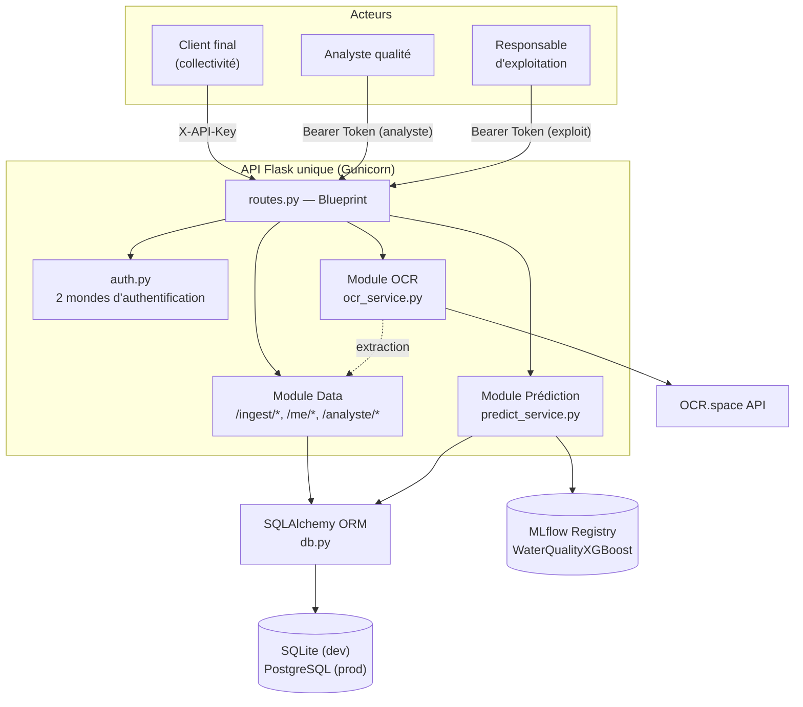
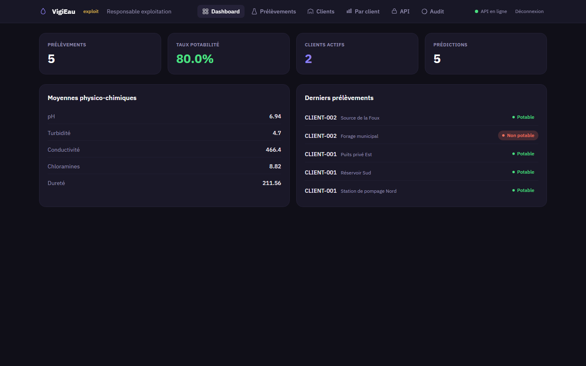
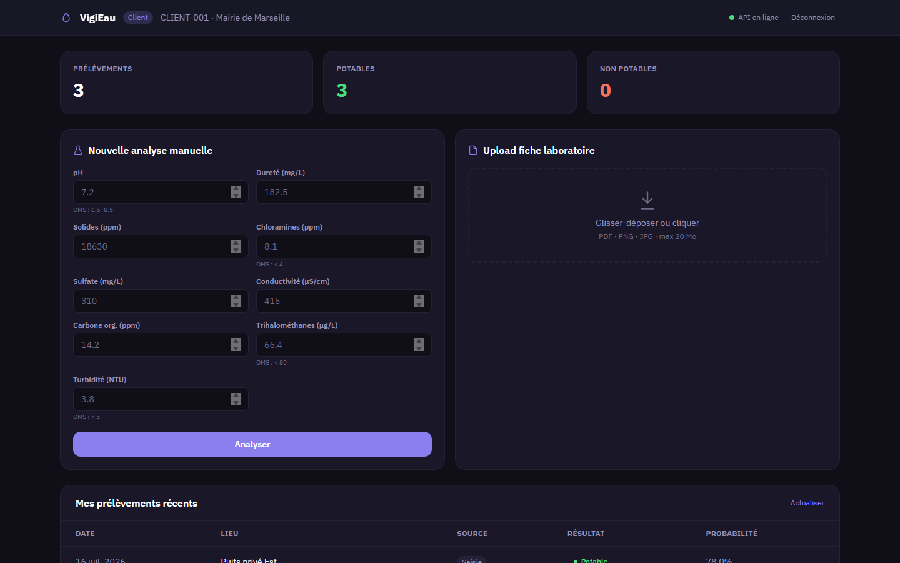
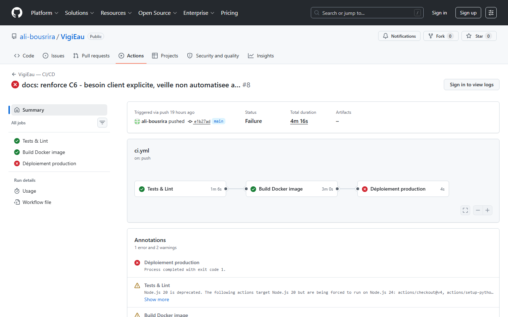

> Structure organisée **par compétence** (C14 à C19), conforme à la
> consigne du REAC — E4 est le versant gestion de projet du chef-d'œuvre,
> [[rapport_e3]] en est le versant dev/ML (même code, même dépôt, deux
> angles de compétences distincts).

# Rapport professionnel — E4 : Application

**Dépôt du projet (public)** : https://github.com/ali-bousrira/VigiEau

## Contexte

Trois profils très différents doivent utiliser la même plateforme sans se
marcher dessus : un client final qui dépose des mesures et consulte ses
propres résultats, un analyste qualité qui a une vue globale, un
responsable d'exploitation qui supervise l'infrastructure — tous via une
**seule interface web**, cohérente avec l'API unique décrite dans
[[architecture]].

---

## C14 — Analyser le besoin d'un commanditaire intégrant un service d'IA

Les parcours ont été formalisés avant/à côté de l'implémentation : 10
user stories avec critères d'acceptation ([[user_stories]]), chacune avec
un critère d'accessibilité RGAA explicite, ancré sur un élément réel de
l'interface plutôt que générique.

**Audit d'accessibilité réel** : plutôt que d'écrire des critères RGAA
"sur le papier", j'ai fait auditer le HTML réellement servi. Résultat :
aucun `<label>` n'était lié à son input sauf un, deux éléments cliquables
(`
`) étaient totalement inutilisables au clavier, aucune
zone `aria-live` n'existait pour les messages dynamiques, et la
navigation par onglets n'avait aucun rôle ARIA. Correctifs vérifiés en
conditions réelles : navigateur headless piloté au clavier (Tab + Entrée
déplie effectivement une carte de l'explorateur d'API), pas seulement
relecture du diff — méthode reprise cette session pour la refonte
visuelle (voir C17) et pour la vérification de la XSS corrigée
([[doc_technique_e5]]).

**Les 10 user stories et leur critère RGAA** (détail complet dans
[[user_stories]]) :

| # | Profil | Critère RGAA (résumé) |
|---|---|---|
| US-01 Création de compte | Client | `<label for>` par champ, résultat annoncé via `aria-live` |
| US-02 Dépôt manuel | Client | Plages OMS liées via `aria-describedby`, résultat jamais porté par la seule couleur |
| US-03 Consultation | Client | Zone `aria-live="polite"`, titres de section en vrais `<h2>` |
| US-04 Dépôt OCR | Client | Zone de dépôt = `<label>` utilisable au clavier, avertissements annoncés |
| US-05 RGPD | Client | Pas d'UI dédiée (API seule) ; futur dialogue de confirmation devra piéger le focus |
| US-06 Dashboard global | Analyste | `role="tablist"`/`tab`/`tabpanel`, filtres avec `<label for>` |
| US-07 Détail prélèvement | Analyste | Résultat couleur + texte, ligne cliquable utilisable au clavier |
| US-08 Métriques système | Exploit | Onglet API générique, paramètres avec `<label for>` |
| US-09 Journal d'accès | Exploit | Onglet "Audit" dédié (voir capture C20 dans [[doc_technique_e5]]) |
| US-10 Gestion clients | Exploit | Labels liés (US-01) ; régénération de clé à annoncer via `aria-live` |

Note sur US-09 : `docs/user_stories.md` décrivait encore l'onglet Audit
comme "pas de vue dédiée à ce jour" — décalage de documentation corrigé
en relisant ce rapport : l'onglet existe et fonctionne réellement (voir
capture dans [[doc_technique_e5]] C20), `user_stories.md` reflète
maintenant cette vue dédiée avec son propre critère RGAA.

**Garde-fou automatisé, pas seulement une vérification ponctuelle** :
`tests/test_accessibility.py` (10 tests — `TestLabels`, `TestLiveRegions`
paramétré sur les 11 zones `aria-live` réelles de l'interface,
`TestTabs`, `TestKeyboardTraps`, `TestHeading`) vérifie mécaniquement sur
le HTML réellement servi les correctifs RGAA décrits ci-dessus, et
tourne à chaque push via `pytest tests/` dans `ci.yml` — la
non-régression RGAA est donc automatisée, pas seulement contrôlée une
fois au clavier.

---

## C15 — Concevoir le cadre technique de l'application

Le trajet des données est formalisé dans [[architecture]] (diagrammes
Mermaid, vérifiés par rendu réel avant d'être considérés fiables plutôt
que supposés corrects à la lecture) : de l'ingestion (5 sources
automatisées + dépôt direct, voir [[rapport_e1]] C1) au stockage, jusqu'à
l'exposition via l'API unique consommée par la même SPA pour les 3
profils.

Un seul service Flask porte les trois profils et les trois modules
fonctionnels (Data/Modèle/OCR) — un choix cohérent avec l'exigence du
cahier des charges ("API modulaire unique") plutôt que trois
micro-services séparés à déployer et versionner ensemble pour un projet
de cette taille. Le pattern racine/`api/` (logique réelle à la racine,
`api/` comme fine couche de ré-export, absent du diagramme ci-dessus par
souci de lisibilité) est documenté dans [[architecture]] — une décision
d'architecture qui a une conséquence directe sur la mesure de couverture
de tests (voir [[rapport_e3]] C12).

---

## C16 — Coordonner sa réalisation technique

Projet individuel (certification RNCP), pas d'équipe à coordonner au
sens strict — l'agilité s'est exprimée dans l'organisation du travail
plutôt que dans un rituel Scrum formel monté artificiellement pour ce
rapport :

- **Backlog priorisé et suivi** : `docs/roadmap.md`, organisé par
  priorité (bloquants CI, bugs fonctionnels, exigences manquantes,
  nettoyage), avec une section "Optionnel" séparée qui sert de backlog
  bonus — le dashboard Prometheus/Grafana y était noté comme optionnel
  avant d'être réalisé cette session (voir [[doc_technique_e5]] C20).
- **Livraison itérative, traçable** : historique Git en commits atomiques
  (un correctif ou une fonctionnalité par commit, message court et
  direct), plutôt qu'un unique commit fourre-tout en fin de projet.
- **Branches de fonctionnalité et merges réels** : depuis cette session,
  le travail à risque (nouvelles sources de données, stack de
  monitorage) est fait sur des branches dédiées, fusionnées avec de vrais
  commits de merge une fois vérifiées — nommées directement plutôt que de
  renvoyer à une commande : `feature/c1-sources-multiples`,
  `feature/c20-monitoring-prometheus-grafana`,
  `fix/c21-prometheus-registry-collision`, fusionnées via les commits
  `e14465c`, `2934af5`, `f20a9f4` (`git log --merges --oneline`).

---

## C17 — Développer les composants techniques et les interfaces

`templates/index.html` est une SPA en JavaScript natif (pas de framework)
servie directement par Flask — cohérent avec le choix "API unique" du
projet plutôt que deux services séparés à déployer et versionner
ensemble. Le rôle de l'utilisateur connecté (`client`/`analyste`/`exploit`)
détermine dynamiquement les onglets visibles et les actions permises —
**la gestion des droits d'accès se fait donc aussi au niveau du site
utilisateur**, pas seulement côté API.

**Maquette** : les parcours experts sont formalisés en wireframes
textuels ([[wireframes]]) décrivant l'enchaînement des écrans avant
l'implémentation — utilisés comme référence pendant le développement de
l'interface, pas rédigés après coup pour justifier ce qui existe déjà.

**Refonte visuelle** (cette session) : palette et typographie retravaillées,
32 émojis remplacés par des icônes SVG cohérentes, focus clavier
réellement visible sur tous les contrôles interactifs, hiérarchie de
titres corrigée — vérifié par navigation clavier réelle en navigateur
headless (Tab + Entrée déplie effectivement une carte de l'explorateur
d'API), pas une relecture du CSS. **Précision honnête** : cette
vérification ponctuelle n'est pas conservée dans le dépôt sous forme de
script (aucune dépendance Playwright dans `requirements.txt`, aucune
trace dans l'historique Git) — contrairement au garde-fou RGAA
automatisé et permanent décrit en C14 (`tests/test_accessibility.py`),
qui lui tourne à chaque push.

**Interface réelle, capturée en conditions réelles** (serveur local,
données de test, pas une maquette) — dashboard exploitant (KPIs agrégés,
onglet Audit visible car rôle `exploit`) et dashboard client (formulaire
de saisie manuelle, historique personnel) :

**Difficulté — corriger un piège clavier peut en révéler un autre.** En
ajoutant l'onglet "Audit" réservé au rôle `exploit`, j'ai découvert que
`showTab()` — la fonction qui recalcule le style des boutons d'onglet à
chaque clic — écrasait la classe `hidden` que je venais de poser dessus.
Un analyste aurait vu apparaître l'onglet Audit dès son premier
changement d'onglet, malgré la restriction de rôle censée le cacher. Je
ne l'ai vu qu'en testant le scénario "connexion analyste" après coup, pas
en relisant le code — une fonctionnalité toute neuve et un correctif
déjà en place peuvent interagir de façons qu'aucun des deux ne laissait
deviner isolément. Exactement le genre de bug que C17 est censé produire
et corriger : gestion des droits d'accès au niveau UI, détecté par un
test de scénario réel, pas par relecture.

---

## C18 — Automatiser les phases de tests lors du versionnement

`.github/workflows/ci.yml` : lint (`ruff`) → `pytest tests/` avec
couverture → build et publication de l'image (GHCR) → déploiement SSH
(voir C19). Les tests évoqués en C9/C10/C17 sont ici rassemblés et
automatisés à chaque push, pas juste exécutés manuellement en local.
**Nuance** : C11-C13 (validation du dataset, entraînement, gate qualité)
tournent, eux, dans `.github/workflows/model-ci.yml` — un pipeline
séparé, déclenché sur `workflow_dispatch` ou sur push touchant
`water_potability.csv`/`scripts/train_model.py`/`requirements.txt` (déjà
décrit ainsi dans [[rapport_e3]] C13) — pas dans `ci.yml`.

**Vu tourner en vert pour de vrai**, après trois corrections successives
sur trois couches différentes, chacune invisible tant que la précédente
bloquait tout :

1. `ci.yml` contenait une erreur de syntaxe YAML (`DATABASE_URL:
   sqlite:///:memory:`, le `:` final rendait la valeur ambiguë sans
   guillemets) — les 3 exécutions précédentes avaient toutes échoué au
   parsing, avant qu'un seul job ne démarre.
2. Une fois la syntaxe corrigée, le job de build Docker a échoué : le
   driver Docker par défaut ne supporte pas l'export de cache
   (`cache-to`) sans `docker/setup-buildx-action` en amont.
3. Une fois le build réussi, le push vers GHCR a été refusé : le workflow
   ne déclarait aucune permission `packages: write` explicite.

Les jobs "Tests & Lint" et "Build Docker image" sont aujourd'hui verts
pour de vrai — je les ai vus tourner, pas seulement lus le YAML :

---

## C19 — Créer un processus de livraison continue

Le job `deploy` de `ci.yml` s'enchaîne après `build` (`needs: build`),
qui s'enchaîne après `test` (`needs: test`) — la livraison continue
intègre donc directement les tests de C18, pas un déploiement qui les
contournerait. Étapes : connexion SSH, pull de la nouvelle image, `docker
compose up -d --remove-orphans`, vérification `/health` avec rollback
visible (logs affichés) en cas d'échec.

**Limite honnête, assumée depuis le début** : ce job échoue aujourd'hui,
et c'est attendu — il cible un serveur de production
(`secrets.DEPLOY_HOST`/`DEPLOY_USER`/`DEPLOY_SSH_KEY`) qui n'existe pas
dans cet environnement scolaire. Le mécanisme de livraison continue est
réel et intégré à la CI (voir C18), mais n'a jamais pu être exécuté
jusqu'au bout faute de cible réelle — une limite d'infrastructure, pas un
défaut du pipeline lui-même.

---

## Résultats globaux

- 10 critères d'acceptation RGAA ajoutés (un par user story), tous
  vérifiables sur un élément réel de l'interface.
- Correctifs d'accessibilité et refonte visuelle vérifiés par navigation
  clavier réelle en conditions réelles ; non-régression RGAA désormais
  automatisée en CI (`tests/test_accessibility.py`, voir C14).
- Nouvel onglet "Audit" dans l'interface exploit, dropdown client dans le
  filtre Prélèvements — visible sur la capture du dashboard exploitant
  (C17 ci-dessus).
- CI applicative vérifiée en direct sur GitHub Actions (jobs "Tests &
  Lint" et "Build Docker image" verts, image poussée sur GHCR) — au prix
  de 3 corrections successives (voir C18).

**Difficulté — la bascule SQLite → PostgreSQL reste à finir, pas juste à
documenter.** `DATABASE_URL` accepte déjà une URL PostgreSQL côté code,
mais `docker-compose.yml` ne déclare aucun service PostgreSQL — j'ai
choisi de documenter clairement cette limite (README) plutôt que
d'ajouter un service non testé juste pour cocher une case.
